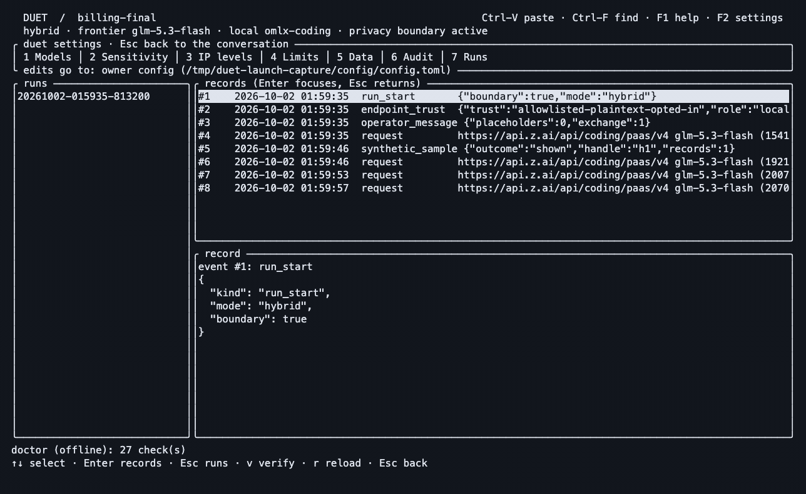

# Duet

### Frontier coding. Local sensitive data. An audit you can verify.

**A coding agent for work you cannot casually send to the cloud.** Duet pairs a frontier coding model with a local model that handles sensitive content. The application checks what crosses the boundary, sandboxes tools, and records outbound requests for inspection.

From the creator of [mlxtop](https://github.com/maximpri/mlxtop), built with Duet.

[Try it](#try-it) · [Watch the real run](docs/launch/FRESH_DOGFOOD.md) · [Inspect the security design](docs/SECURE_BY_DESIGN.md) · [Evaluate for your organization](docs/INSTITUTIONAL_EVALUATION.md)


*Actual model calls and TUI output; fictional customer data. Edited highlights from a fresh dogfood run: **4/4 tests passed**, **0 matches for 13 planted values in 5 recorded frontier requests**. Local inference used an owner-controlled LAN endpoint. [Original recording, checks, transport limits and reproduction](docs/launch/FRESH_DOGFOOD.md).*

## Give the model the problem. Control the context.

A billing bug needs the schema and failing tests. It does not need your customers' names or account balances. An integration can often work from an interface without seeing the proprietary implementation.

Duet is designed to make that separation practical:

| What you need | What Duet does |
| --- | --- |
| **Capable coding** | A frontier model plans, edits open code and runs checks; diffs and results stay visible in the terminal |
| **Local handling of sensitive content** | Sensitive files become references, structure and checked local answers; detected credentials become placeholders |
| **Control over proprietary code** | Mark source interface-only or sealed to limit what the frontier sees |
| **Enforcement outside the model** | Outbound checks, OS tool isolation and owner policy constrain model and repository instructions |
| **Detailed audit logs** | Inspect prepared requests, endpoint/model, timestamps, hashes and boundary events; verify the chain against an external local anchor |
| **A workflow with no frontier** | Top clearance uses the configured local model and disables frontier calls, web tools and command networking |

**Hybrid sends open code and checked context to your frontier provider.** Classification and summaries have limits. “Local” means your configured, trusted endpoint: loopback for same-device inference, or a secured self-hosted server. Duet is a development preview; the [threat model](SECURITY.md) defines what it protects and what it does not.

## Try it

Source build for **macOS or Linux**, with Rust 1.90+, Cargo and Git. Linux command isolation requires bubblewrap and seccomp support. Start an approved local model server and configure a frontier provider key using the [model setup guide](docs/USAGE.md#models). No published release binary yet.

```sh
git clone https://github.com/maximpri/duet.git
cd duet
./tools/install.sh
export PATH="$HOME/.local/bin:$PATH"
duet setup
duet doctor
```

Open your repository and give Duet a task:

```sh
duet --check 'python3 -m unittest -v'
# Or run a single task:
duet run --check 'cargo test --offline' 'Fix the failing export'
```

For a first trial, use the [fictional billing repository](docs/launch/DEMO.md#reproduce-the-task). Watch the fix in **Changes**, switch to **Privacy** with **Tab**, and press **Ctrl-O** to inspect the selected record. [Full usage guide](docs/USAGE.md).

For repositories that allow no frontier disclosure:

```sh
duet --mode top-clearance
# Require this mode for the repository:
duet config set --project clearance.required top
```

This mode still contacts the configured local endpoint. Coding quality depends on that model. [Watch the separate real top-clearance run](docs/launch/DEMO.md#a-separate-top-clearance-task).

## See what left. Verify the record.

```sh
duet audit show <run-id>
duet audit verify <run-id>
duet audit disclosure <run-id>
```



The audit records the prepared outbound body and security decisions. Image payloads are represented by digests. The hash chain and owner-state anchor expose changes to the saved record; they do not prove the content was safe or that the provider received it. Logs can themselves hold sensitive content and need protected storage. [Audit fields, custody and verification](docs/INSTITUTIONAL_EVALUATION.md#what-the-audit-actually-records).

Our first launch dogfood **passed its coding tests and failed its privacy check**. We kept both failed audits, fixed the diagnostic-preview and local-summary paths, and reran the task. [Inspect the failure, regression tests and successful rerun](docs/launch/DEMO.md#what-the-first-run-found).

## Quality and cost, measured

The frozen development comparison used the same frontier model (`glm-5.3-flash`), six tasks and three paired seeds: **18 runs per lane**. Hybrid used local Qwen 3.8 27B; passthrough used the same agent with the privacy boundary disabled.

| Measure | Duet hybrid | Passthrough |
| --- | ---: | ---: |
| Planted canary occurrences in outbound traffic | **0** | 3,720 |
| Hidden tests passed | **98.3%** | 97.5% |
| Mean modeled total cost | $0.02565 | $0.01892 |
| Mean wall time | 539 s | 259 s |

Similar task results on this suite, at **1.36× cost and 2.08× time**. The initial harder XL batch missed the quality goal. These are project-run measurements with accounting limits, not universal frontier parity. [Methods, failures and later fixes](docs/VALUE_EVIDENCE.md).

**Frontier-level results at a fraction of the cost are the goal.** The current privacy benchmark does not demonstrate savings. The [next comparison protocol](docs/launch/COST_QUALITY_PLAN.md) defines the quality, privacy and total-cost evidence needed to earn that claim.

## Built for scrutiny

If you build software for a bank, government department or another organization handling confidential data, start with a question your team can test: **what is this agent allowed to disclose, and how would we know if it did?**

The [institutional evaluation guide](docs/INSTITUTIONAL_EVALUATION.md) provides a synthetic pilot, a control-to-evidence map and the remaining deployment work: managed identity and policy, secured endpoints, external audit custody, release provenance and independent assessment. Duet does not yet claim certification, institutional approval or comparative “most secure” status.

Try the fixture. Inspect the requests. Contribute a reproducible test that makes the boundary stronger. [Non-sensitive issues](https://github.com/maximpri/duet/issues) · [Security reporting status](SECURITY.md#reporting-a-vulnerability) · [Contributing](CONTRIBUTING.md).

If this is a tool you want to use, **star Duet to follow its development**.

[GPL-3.0-or-later](LICENSE) · [Architecture](ARCHITECTURE.md) · [Extensions](docs/EXTENSIONS.md) · [Measured evidence](docs/VALUE_EVIDENCE.md) · [Development plan](docs/PLAN.md)
