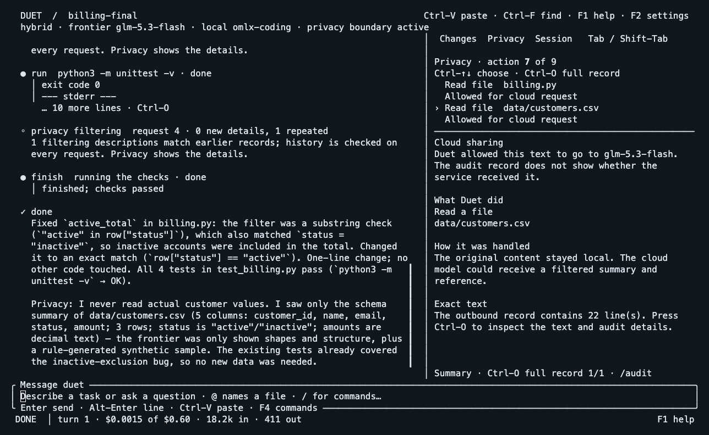
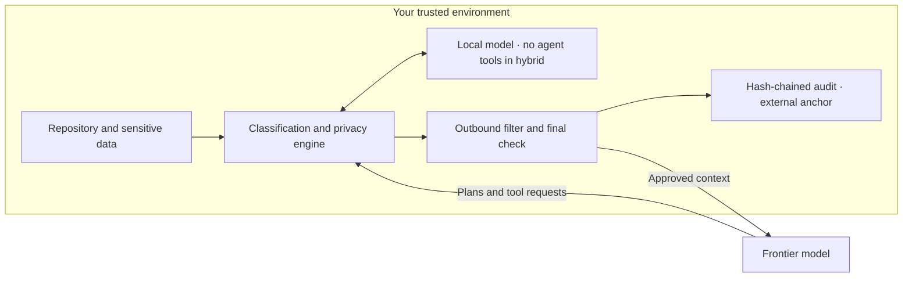
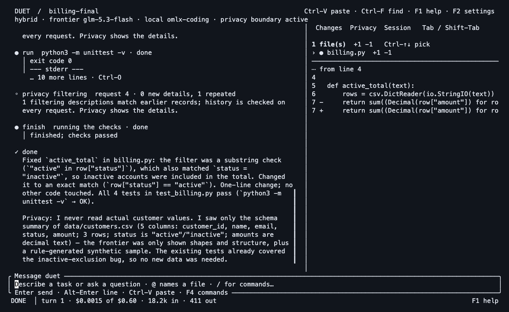

# Duet

### Frontier reasoning. Local secrets. Verifiable boundaries.

**A coding agent built around a security boundary you can inspect.** A frontier model plans and writes code. A model you control handles sensitive content. Duet checks what may cross between them and records the outbound requests.

For engineers working with customer records, credentials and proprietary code—and the security teams who need to know what their AI tools disclose.

[Try it](#try-it) · [Security design and proof](docs/SECURE_BY_DESIGN.md) · [Watch the dogfood run](docs/launch/DEMO.md) · [Measured results](docs/VALUE_EVIDENCE.md) · [Threat model](SECURITY.md)



*Real TUI, real model calls, fictional customer data. Highlights are shortened; [run IDs, original recordings, audit records and reproduction steps](docs/launch/DEMO.md) are included. This capture uses an owner-configured model on a LAN host; see the transport limitation there.*

> **Development preview.** No independent audit or certification. Hybrid mode sends open code and checked context to a cloud provider. Detection and local summaries have limits. Use top clearance with an approved local endpoint when no frontier disclosure is acceptable.

## The model fixing your code does not need your customer records

A billing bug needs column names, value formats and failing tests. A database integration needs to know where a connection setting is used. A caller of your proprietary pricing engine may need its interface.

Duet separates those needs from the underlying values:

| Inside your trusted environment | What the frontier may receive |
| --- | --- |
| Credentials and detected secrets | Placeholders, resolved locally when appropriate |
| Sensitive CSVs, databases and data files | Handles, structure, synthetic examples and checked local answers |
| Sensitive logs | Sanitized diagnostics, structure and checked local summaries; see the [remaining limits](SECURITY.md#what-is-not-protected) |
| Source marked interface-only | Signatures and types; implementation withheld |
| Source marked sealed | Existence only |



**Local means an endpoint you control and trust.** Loopback keeps model traffic on the workstation. A self-hosted server adds that host and network path to the trust boundary; use TLS or an SSH tunnel. Open code, file structure and some semantic information are still disclosed in hybrid mode.

## Secure by design, with evidence

The model is not responsible for enforcing its own permissions.

| Control | How it is enforced | Inspect the proof |
| --- | --- | --- |
| **A checked outbound boundary** | Frontier requests pass filtering and a final check; uncleared content is withheld or the request fails | [Gate and transport tests](docs/SECURE_BY_DESIGN.md#1-outbound-requests-have-one-checked-path) |
| **Tools cannot simply read around it** | OS sandbox denies ordinary commands sensitive paths, `.git`, Duet state and credential stores | [Command isolation tests](docs/SECURE_BY_DESIGN.md#2-tool-permissions-live-outside-the-model) |
| **Local answers are untrusted too** | Copied spans, encoded values and repeated extraction probes are checked | [Adversarial scenarios](crates/duet-cli/tests/privacy_scenarios.rs) |
| **Repository instructions cannot grant privileges** | Project settings can tighten owner policy; they cannot set endpoints or loosen it | [Configuration and policy tests](docs/SECURE_BY_DESIGN.md#3-the-repository-cannot-promote-its-own-permissions) |
| **A record you can verify** | Request bodies and decisions enter a hash chain, anchored outside the repository | [Live audit and tamper demonstration](docs/launch/DEMO.md) |
| **A mode with no frontier** | Top clearance uses the configured local model; web and command networking are disabled | [Mode tests and live capture](docs/SECURE_BY_DESIGN.md#5-top-clearance-removes-the-frontier) |

Our launch dogfood found disclosure gaps in a diagnostic preview and a local summary. We retained the failed audit, reproduced it in a transport-level test, fixed those paths, and reran the task. [Read the before/after evidence](docs/launch/DEMO.md#what-the-first-run-found). Security claims should survive inspection.

## What the measurements say

The frozen development comparison used **18 paired runs per lane**, the same frontier model (`glm-5.3-flash`), six tasks and three seeds. Duet hybrid used local Qwen 3.8 27B; the comparison was the same agent with the privacy boundary disabled.

| Measure | Duet hybrid | Passthrough |
| --- | ---: | ---: |
| Planted canary occurrences in outbound traffic | **0** | 3,720 |
| Hidden tests passed | **98.3%** | 97.5% |
| Mean modeled total cost | $0.02565 | $0.01892 |
| Mean wall time | 539 seconds | 259 seconds |

That is quality retention on this suite at **1.36× modeled cost and 2.08× time**. The first XL batch missed its quality target. Zero observed canaries is not proof against every disclosure; the new dogfood failure illustrates why. These are project-run measurements, not an independent audit or a comparison against every coding agent. [Methods, failed results, later fixes and accounting limits](docs/VALUE_EVIDENCE.md).

**Frontier-level results at a fraction of the cost remain the goal.** The current paired privacy benchmark does not establish cost savings. Software has no license fee; inference, hardware, electricity and operations still have costs.

## Try it

Development source build for macOS or Linux; Rust 1.90+, Cargo and Git required. Linux command isolation requires bubblewrap and seccomp support. No published release binary yet.

```sh
git clone https://github.com/maximpri/duet.git
cd duet
./tools/install.sh
export PATH="$HOME/.local/bin:$PATH"
duet setup
duet doctor
```

Start your local model server and set your chosen frontier provider's API key in its documented environment variable before `duet setup`. Setup discovers models and shows the configuration before saving. [Providers, endpoint configuration and prerequisites](docs/USAGE.md#models).

```sh
duet                                         # interactive workspace
duet --check 'cargo test --offline'           # require tests before finish
duet run "Fix the failing billing export"     # one task
duet audit show <run-id>                      # inspect outbound request records
duet audit verify <run-id>                    # verify chain and external anchor
duet audit disclosure <run-id>                # disclosure counts by class
```

Start with the [reproducible fictional billing task](docs/launch/DEMO.md#reproduce-the-task). For work that must not go to a frontier provider:

```sh
duet --mode top-clearance
# Or require this mode for a repository:
duet config set --project clearance.required top
```

Top clearance still contacts your configured local endpoint. Its coding quality depends on that model; it does not inherit frontier quality. The operating environment and endpoint must satisfy your organization's requirements.

## A terminal you can work in



Streamed conversation, code diffs, selectable privacy decisions, exact outbound records and session budgets live together. **Tab** changes panels; **Ctrl-O** opens a privacy record; **F4** opens commands. Goals, saved sessions, attachments, skills, MCP and Git follow the agent's boundary. [Complete usage guide](docs/USAGE.md) · [Extension model](docs/EXTENSIONS.md).

## Evaluating Duet for a bank or government team

Start with a synthetic pilot and review the actual data flows. The [security evidence guide](docs/SECURE_BY_DESIGN.md) maps controls to code and tests and identifies work still needed for an institutional deployment: independent assessment, managed endpoints and policy, durable audit collection, retention, incident response and release provenance.

Duet does not currently claim regulatory approval, bank certification, universal data residency, or to be the “most secure” coding agent. A compromised host, unrecognized sensitive content and meaning conveyed by summaries remain risks. [Full threat model](SECURITY.md).

## Why I’m building it

Created by **Maxim Priezjev, former Senior Managing Architect at TD Bank**, and creator of [mlxtop](https://github.com/maximpri/mlxtop). Duet is an independent personal project; the former role does not imply TD Bank endorsement or use.

The aim is practical: let engineers use capable coding models while giving security teams inspectable control over what those models receive.

## Help make the boundary stronger

Try a fictional-data task. Inspect the outbound audit. Share a reproducible failure or help build a missing platform check. [Report non-sensitive bugs](https://github.com/maximpri/duet/issues); follow [the security policy](SECURITY.md#reporting-a-vulnerability) for disclosure paths. A working private reporting contact is a [public-launch prerequisite](docs/launch/CAMPAIGN.md#before-a-broad-launch).

If this is a tool you want to follow, star the repository.

[GPL-3.0-or-later](LICENSE) · [Architecture](ARCHITECTURE.md) · [Acceptance gates](docs/ACCEPTANCE.md) · [Development plan](docs/PLAN.md)
