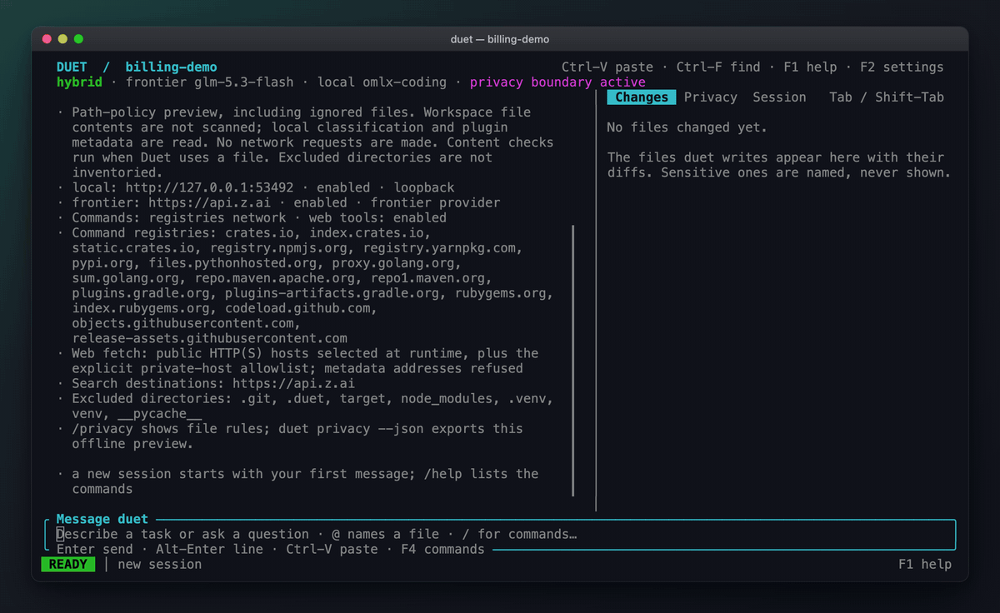
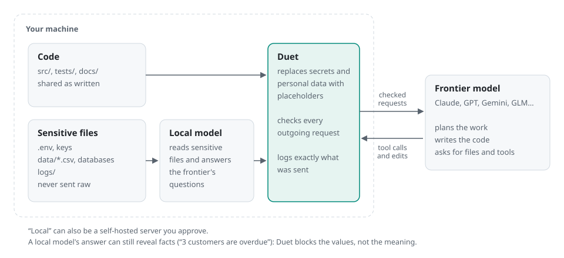
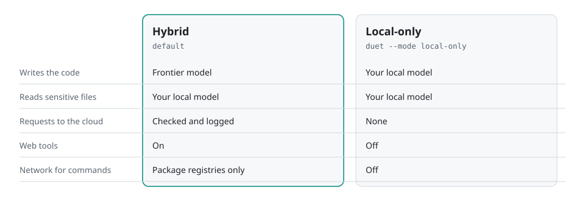

<div align="center">


# Duet

**An AI coding agent that pairs a cloud model with a local one,<br>
so Claude or GPT can fix your code without seeing your secrets.**

The cloud model writes the code. Your local model reads the `.env`, customer data and logs.<br>
Duet checks every request before it leaves your machine.

[](https://github.com/maximpri/duet/releases/latest)
[](LICENSE)
[](docs/INSTALLATION.md)



<sub>A real session on fictional customer data. The bug is fixed, the tests pass, and none of the 13 planted secrets appear in the 5 requests sent to the cloud. Agent work plays at 6× speed. <a href="docs/evidence/recorder-billing-2026-10-04/README.md">Recording and evidence</a></sub>

</div>

Coding agents send whatever they read to the model provider. That includes your `.env`, the customer export you asked about, and the production log you pasted in. Running everything locally avoids this, but local models are still well behind the best cloud models at writing code.

Duet splits the work. The cloud model plans and writes the code. Your local model reads the sensitive files and answers the cloud model's questions about them. Duet checks every request before it leaves your machine and keeps a record of exactly what was sent.

I built Duet out of my experience working at major regulated financial institutions.

## Install

macOS and Linux, on ARM64 or x86-64:

```sh
curl -fsSL https://raw.githubusercontent.com/maximpri/duet/main/install.sh | bash
```

This installs `duet` to `~/.local/bin` and adds it to your `PATH` (pass `--no-modify-path` to skip that). No `sudo` or Rust toolchain needed. Releases are not signed yet: the installer verifies checksums, which catch corrupted downloads but don't prove who published them. For disk images, building from source or verifying signatures, see the [installation guide](docs/INSTALLATION.md).

## Quick start

Open a new terminal in your project and run:

```sh
duet
```

The first time, Duet looks for a cloud API key in your environment and a local model server, shows what it found, and asks before saving anything. If one of them is missing, it tells you the command that fixes it. If you don't have a local model yet, install [Ollama](https://ollama.com) and pull one (for example `ollama pull qwen3:8b`), then run `duet doctor --online` to check its context window is big enough.

Then describe the task:

```text
the billing export counts inactive customers in active_total, fix it
```

To make Duet keep going until your tests pass:

```sh
duet --check 'npm test' "fix the failing export tests"
```

## How it works

<picture>
  <source media="(prefers-color-scheme: dark)" srcset="docs/assets/infographics/duet-flow-dark.svg">
  
</picture>

- Ordinary code is sent to the cloud model as it is. Files that match your sensitive patterns (by default `.env*`, keys, `data/**`, CSVs, databases and logs) are not. The cloud model gets their structure (column names, value types, synthetic example rows) and can ask your local model specific questions about them.
- Everything that goes out, including the local model's answers, is checked against the private values Duet has seen. Secrets and personal data are replaced with placeholders such as `⟨secret:URL_PASSWORD#1⟩`. The local model can't approve its own answers.
- Commands run in an OS sandbox (Seatbelt on macOS, bubblewrap on Linux) with network access limited to package registries.
- The Changes panel shows the diff. The Privacy panel shows each request and what was filtered from it. `duet audit show <run>` prints the full log, which is hash-chained so you can check it hasn't been altered.

This doesn't make leaks impossible. Duet blocks known private values, not meaning: an answer like "3 customers are overdue" still goes out. [What is and isn't covered](docs/SECURE_BY_DESIGN.md)

## Modes

<picture>
  <source media="(prefers-color-scheme: dark)" srcset="docs/assets/infographics/duet-modes-dark.svg">
  
</picture>

Hybrid is the default. `duet --mode local-only` keeps everything on your machine, at the cost of coding quality.

Within a session, the badge in the header shows what Duet will do with your next message:

- **BUILD**: edits files and runs commands. This is the normal mode.
- **PLAN**: `/plan <task>` investigates with read-only tools and saves a plan you can review, edit and approve. `/plan implement rN` carries it out.
- **GOAL**: `/goal <outcome>` keeps working across turns until the goal is met or its turn limit runs out.

## Benchmark

<picture>
  <source media="(prefers-color-scheme: dark)" srcset="docs/assets/infographics/duet-results-dark.svg">
  
</picture>

I ran nine coding tasks, each containing planted private data (customer records, credentials, logs, proprietary pricing), three times with Duet and three times with the same cloud model and no protection. Hidden tests scored the code. Here is every run:

<picture>
  <source media="(prefers-color-scheme: dark)" srcset="docs/assets/infographics/duet-results-by-task-dark.svg">
  
</picture>

Most of the gap between the two averages comes from two Duet runs that scored zero: one produced code that didn't compile, and one was stopped at its time limit. Both are counted.

The privacy check looks for complete planted values (also base64, hex and URL-encoded) in the recorded requests. It can't detect a secret leaked in pieces or paraphrased. The tasks are mine, it's one cloud model, and three runs per task is a small sample. [Method and full evidence](docs/evidence/benchmark-54-2026-10-04/README.md) · [Results as a table](docs/DUET_VISUAL_GUIDE.md#results-by-task) · [Raw data](docs/evidence/benchmark-54-2026-10-04/report.json)

## Usage

```sh
duet                                 # start a session
duet "fix the failing export"        # start with a task
duet --check 'cargo test' "fix it"   # finish only when the check passes
duet --mode local-only               # use only your local model
duet --resume                        # continue the last session
duet run "fix the export"            # run once without a conversation
duet privacy                         # show what's sensitive and where requests go
duet audit show <run>                # show everything a run sent to the cloud
duet doctor                          # check your setup
```

To give private code less exposure, list it in `.duet/config.toml`:

```toml
[sensitivity]
protected_paths = ["src/billing/**"]   # read only by the local model

[ip]
interface_only = ["src/pricing/**"]    # the cloud model sees signatures, not bodies
sealed = ["src/risk_model/**"]         # the cloud model only knows the files exist
```

Every session also has a dollar budget, and F2 opens the settings. Duet works with MCP servers, language servers, web search and `SKILL.md` skills, all behind the same checks. [Usage guide](docs/USAGE.md)

## Models

Cloud: Anthropic, OpenAI, Google Gemini, OpenRouter, z.ai, DeepSeek, xAI, Mistral, Groq, Cerebras, Together, Fireworks and Qwen, or any OpenAI-compatible endpoint.

Local: Ollama, LM Studio, llama.cpp, vLLM, oMLX, MLX, Jan, GPT4All, KoboldCpp, LocalAI and LiteLLM. The local model needs a context window of about 40K tokens. In hybrid mode it only reads and answers questions, so it doesn't need to be good at coding.

## Status

Duet is an early release. It has over 1,300 tests and fuzzing, and its Rust code forbids `unsafe`, but it hasn't had an outside security review and releases aren't signed. Read [the security design](docs/SECURE_BY_DESIGN.md) before using it with real regulated data.

Bug reports and "it didn't work on my setup" reports help the most right now: [open an issue](https://github.com/maximpri/duet/issues). I'll accept code contributions once the contributor agreement is published ([details](CONTRIBUTING.md)). Report vulnerabilities privately through a [security advisory](https://github.com/maximpri/duet/security/advisories/new) ([policy](SECURITY.md)).

## License

[GPL-3.0-or-later](LICENSE). Release archives include the corresponding source and third-party notices ([licensing](LICENSES.md)).
