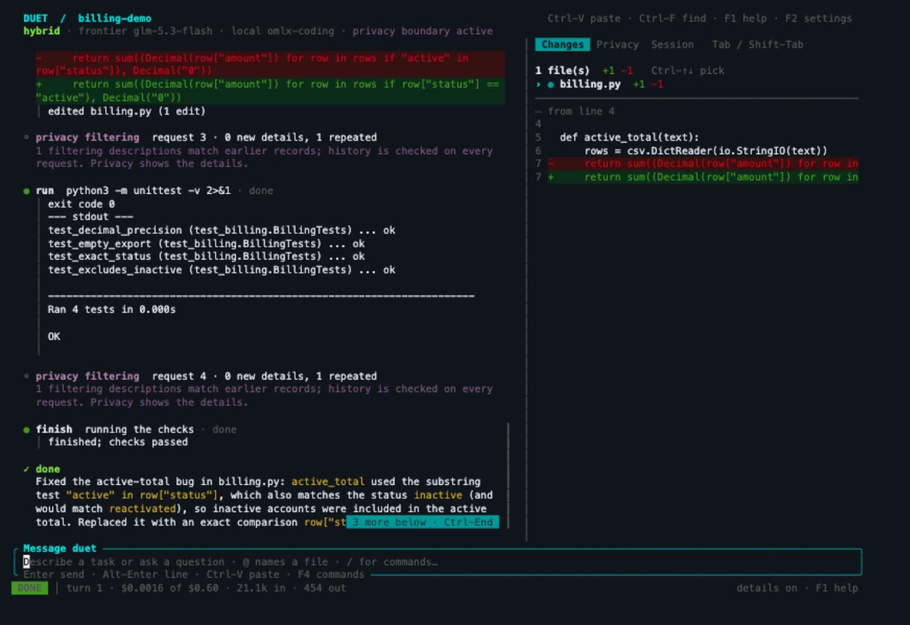
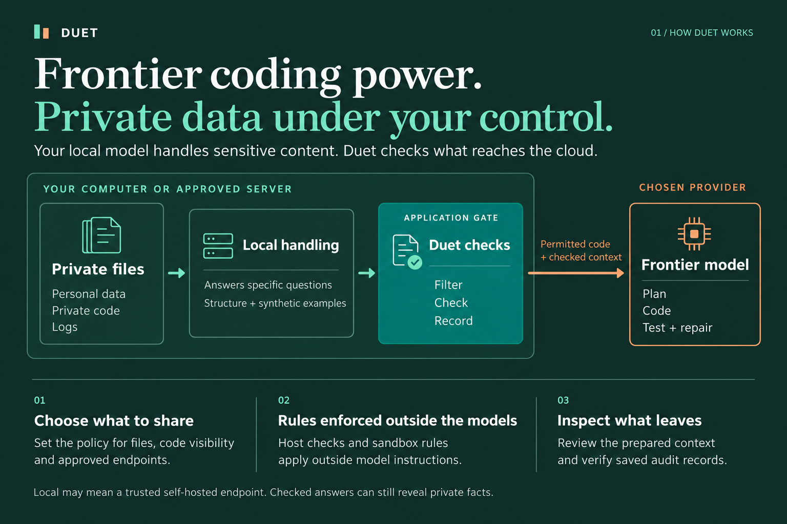
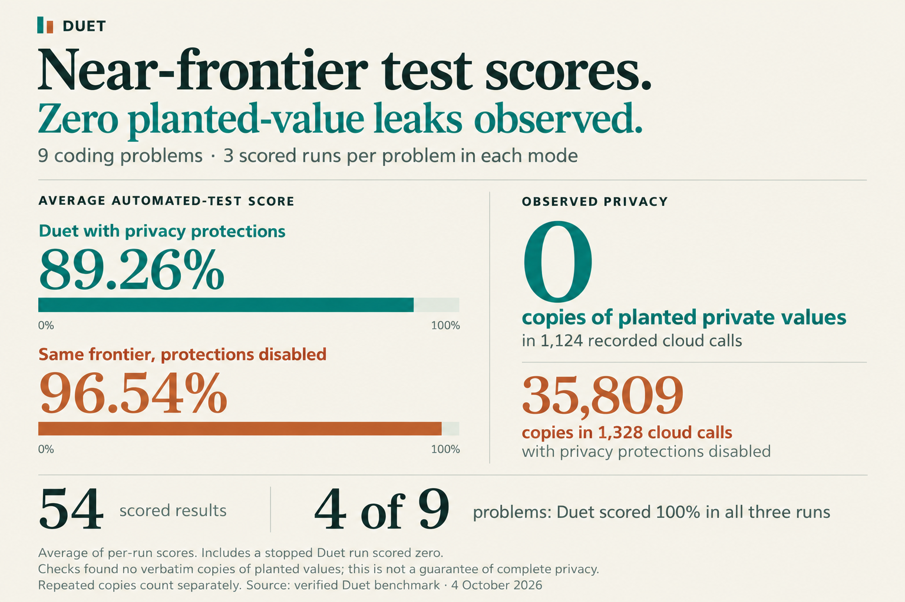
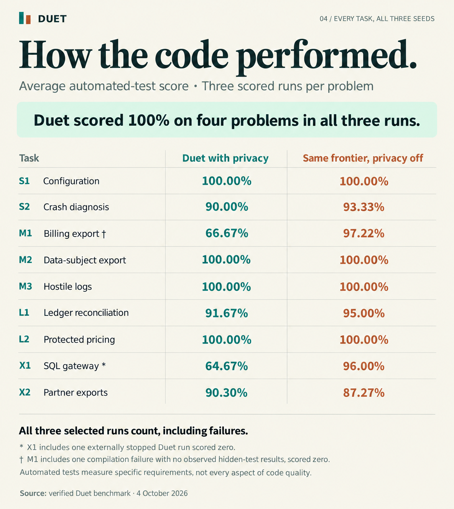
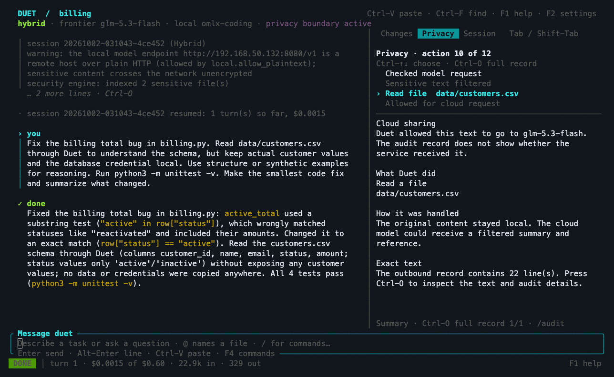

# Duet

**Frontier coding. Local privacy controls.**

Duet is an AI coding assistant for your terminal. A frontier model plans, writes and fixes code. Your local model handles sensitive files, and Duet checks the context sent to the cloud.

[Install](#install) · [Get started](#get-started) · [How it works](#how-the-agent-works) · [Results](#results) · [Documentation](docs/README.md) · [Downloads](https://github.com/maximpri/duet/releases/latest)

- **Choose what the frontier sees.** Share ordinary code, expose a private module's interface, or keep its implementation sealed.
- **Inspect the work and the disclosure.** Review patches in **Changes**, outbound context in **Privacy**, and saved audit records.
- **Use your own model for the whole task.** Local-only mode disables frontier calls, web tools and command networking.



*A real Duet session with fictional customer data: one of four tests fails before the fix; all four pass afterward. Checks found none of the 13 complete planted private values in four recorded frontier requests.* [Try the example](docs/launch/DEMO.md#reproduce-the-task) · [Patch, tests and request checks](docs/evidence/billing-demo-2026-10-04/README.md)

## Install

**macOS and Linux · Apple Silicon/ARM64 and Intel/x86-64**

```sh
curl --proto '=https' --proto-redir '=https' -fsSL https://raw.githubusercontent.com/maximpri/duet/main/install.sh | bash -s -- --allow-unsigned
```

The installer selects the latest release, checks its files and installs to `~/.local/bin`. It retains the matching GPL source and licenses. No Rust compiler or administrator access is needed.

Preview releases are **unsigned**. Checksums detect changed files; they do not authenticate the publisher. This command trusts GitHub over HTTPS. Signing is optional.

[macOS disk images and Linux archives](https://github.com/maximpri/duet/releases/latest) · [Inspect the installer, verify signatures or build from source](docs/INSTALLATION.md)

Linux requires glibc, bubblewrap, user namespaces and seccomp support for command isolation. macOS disk images are not Apple-signed or notarized.

## Get started

For hybrid mode, start a compatible local model server and set your frontier provider's API-key environment variable. [Model setup](docs/USAGE.md#models) covers supported providers and local endpoints. `duet setup` discovers available models; it does not download them.

From your project directory:

```sh
export PATH="$HOME/.local/bin:$PATH"
duet setup
duet doctor
duet privacy
duet
```

Describe what you want to build or fix. To require passing tests before Duet finishes, give it your project's test command:

```sh
duet --check 'python3 -m unittest -v' "Fix the failing billing tests"
```

To use only your approved local model:

```sh
duet --mode top-clearance
```

## How the agent works

The frontier model is the coding agent: it plans the work, requests tools and writes fixes. Your local model reads sensitive content when needed. Duet controls file access, tool execution and what reaches the frontier.



1. **You set the task and privacy rules.** Choose which files the frontier may see, which need local handling, and which model endpoints to trust.
2. **The frontier asks for what it needs.** Duet supplies permitted code, file structure or synthetic examples. For sensitive content, the local reader can answer a specific question without giving the frontier the raw file.
3. **Duet checks what leaves.** Local answers and other outbound context are filtered, checked and recorded by the application. The local reader cannot approve its own answer for disclosure.
4. **The agent makes changes and runs tests.** Duet runs commands in an operating-system sandbox. With `--check`, failed acceptance checks return filtered feedback for another repair attempt, within the run's limits. Duet marks the task complete only after those checks pass.
5. **You inspect the result.** Review the patch in **Changes**, the prepared frontier context in **Privacy**, and the saved audit records.

For example, a billing fix can use column names, status labels and synthetic rows to reason about a bug while the original customer records stay under local handling. The screenshot above shows that task completed with passing tests.

“Local” means your workstation or an approved self-hosted endpoint. Hybrid mode sends permitted code and checked context to the frontier; summaries can still reveal private facts. Use `duet privacy` to inspect your policy and destinations. In top-clearance mode, your approved local model takes over the coding-agent role, with frontier calls, web tools and command networking disabled.

[Architecture and modes](docs/DUET_VISUAL_GUIDE.md) · [Security design and implementation](docs/SECURE_BY_DESIGN.md) · [Audit and retention](docs/OPERATIONS.md)

## Results

**Near-frontier automated-test scores, with zero observed copies of planted private values.**

We ran nine coding tasks three times in each mode: **54 scored outcomes**, using the same frontier model (`glm-5.3-flash`). Hidden tests checked whether the resulting code met each task's requirements.



| Measurement | Duet hybrid | Frontier with privacy boundary disabled |
| --- | ---: | ---: |
| Mean automated-test score | **89.26%** | **96.54%** |
| Literal planted-value matches in recorded requests | **0** | **35,809** |
| Recorded frontier requests checked | 1,124 | 1,328 |

Duet scored within **7.28 percentage points** of the frontier baseline while keeping the planted private values out of the recorded frontier requests. Each run has equal weight in the average; repeated copies of a value count separately in the disclosure check.

### Across all nine tasks

Duet scored **100% in all three runs on four tasks**: configuration, data-subject export, hostile logs and protected pricing. Billing export and the SQL gateway account for most of the overall score gap.



All selected outcomes count, including a compilation failure and an externally stopped hybrid run scored zero. These project-run coding tests measure specific requirements, not every aspect of quality. Zero literal matches do not rule out disclosure through summaries or inference.

[Every task's scores as text](docs/DUET_VISUAL_GUIDE.md#results-by-task) · [Method and complete evidence](docs/evidence/benchmark-54-2026-10-04/README.md) · [Machine-readable results](docs/evidence/benchmark-54-2026-10-04/report.json)

<details>
<summary>Watch the privacy controls in Duet's terminal</summary>



This earlier walkthrough uses unchanged native screenshots, held for five seconds each. Playback length does not represent task duration. [Capture details and verification](docs/launch/DEMO.md#native-screenshots).

</details>

## Documentation and feedback

Duet is a development preview. Start with the included example and share what worked or got in your way.

- [Usage and configuration](docs/USAGE.md) · [Extensions](docs/EXTENSIONS.md) · [All documentation](docs/README.md)
- [Report a bug or suggest an improvement](https://github.com/maximpri/duet/issues)
- [Report a vulnerability privately](https://github.com/maximpri/duet/security/advisories/new) · [Security policy](SECURITY.md)
- [Contributing](CONTRIBUTING.md): outside code contributions are closed until the CLA is published. Bug reports and feedback are welcome.

## License

[GPL-3.0-or-later](LICENSE). Release archives include corresponding source and third-party notices. See [licensing and distribution](LICENSES.md).
