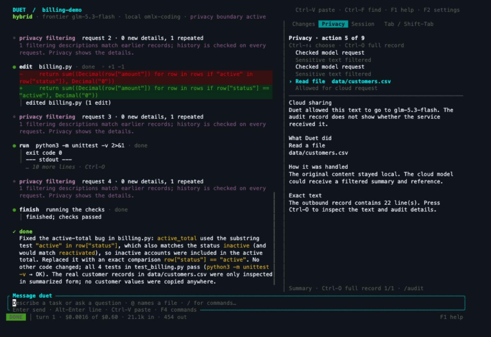
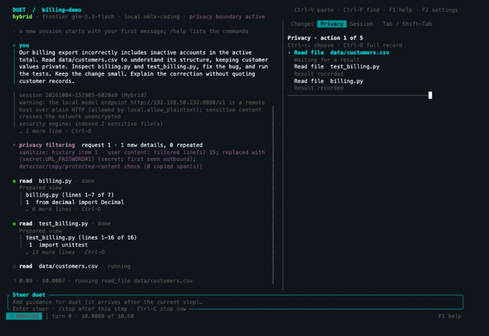
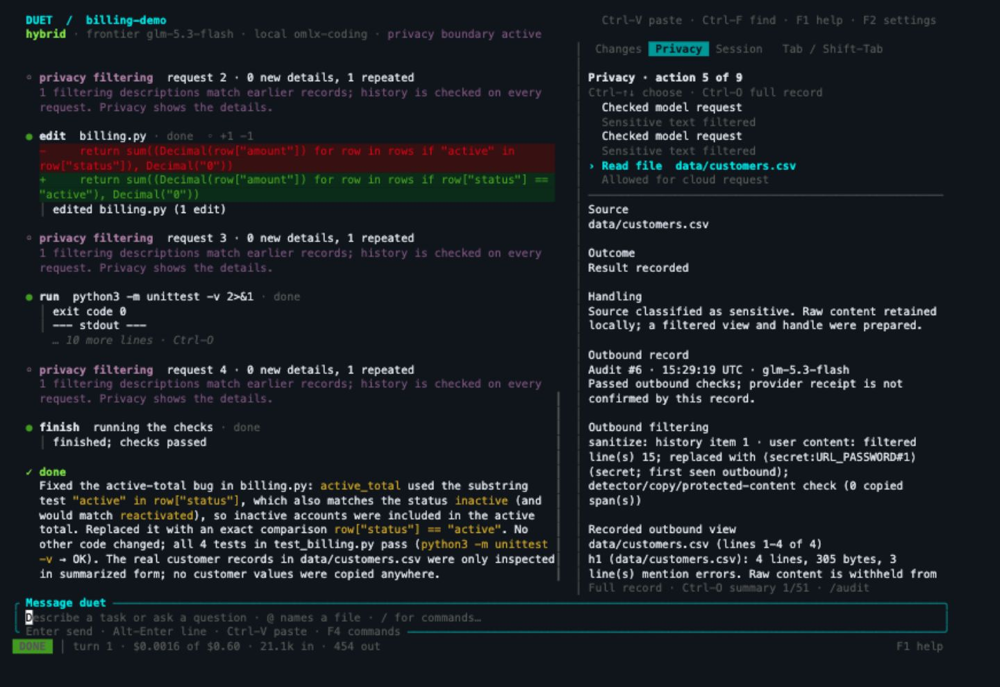

# Duet

**Frontier coding power. Private data under your control.**

Duet is an AI coding assistant for anyone who cares about privacy and security. A frontier model plans, writes and fixes code. Your local model handles sensitive content, and Duet checks what reaches the cloud.

In our benchmark, Duet averaged **89% on automated coding tests**, close to the same frontier model’s **97% with privacy protections disabled**. **None of the planted private values appeared in Duet’s 1,124 recorded calls to the cloud model.**

Build a personal project. Work on private source code. Debug logs that contain personal information. Choose which files the frontier can see, keep sensitive content with your own model, and inspect what leaves your environment.

## Fix a billing bug without exposing customer records

*Actual Duet session using fictional customer data.*


**Review the fix and its tests.** Duet replaced a substring check with an exact status comparison. Inactive accounts are excluded, and all four tests pass.



**See how sensitive content is handled.** The recorded frontier requests contain a structure view, a generated sample and a filtered local-model summary. An independent check found **zero matches for 13 complete planted private values across four recorded frontier requests**. This checks recorded content; it does not establish that summaries reveal no private facts.

<details>
<summary>Task in progress and expanded outbound record</summary>



**Work with private data.** Follow the task and sensitive-file handling in hybrid mode.



**Inspect what goes to the frontier.** Select a Privacy event and press `Ctrl-O` to inspect its outbound text and audit details.

</details>

These October 4 screenshots capture the running application's 140-column TUI in a live xterm.js terminal viewer. The configured local model ran on an owner-approved LAN endpoint. [Run, outbound content and verification](docs/evidence/billing-demo-2026-10-04/README.md) · [Try the demo](docs/launch/DEMO.md#reproduce-the-task) · [Earlier native Terminal captures](docs/launch/DEMO.md#native-screenshots)

## Your code, your sharing rules


- **Keep sensitive files inside your trusted environment.** The local model reads them; the frontier works with references, structure views and checked answers.
- **Choose what code to share.** Give the frontier ordinary source, expose a private module's interface, or keep its implementation sealed.
- **Enforce policy outside the models.** The application checks outbound requests and the OS isolates commands. Repository instructions cannot grant themselves broader permissions.
- **See what changed and what was shared.** Review the patch in **Changes**, prepared frontier context in **Privacy**, and saved audit records with built-in verification.
- **Use your own model for the whole task.** Top-clearance mode runs the coding agent at your approved local endpoint, with frontier calls, web tools and command networking disabled.

“Local” can be your workstation or an approved self-hosted endpoint. In hybrid mode, permitted code and checked context reach the frontier; summaries can still reveal meaning. [See the two modes](docs/DUET_VISUAL_GUIDE.md#choose-the-data-flow) and the [security design](docs/SECURE_BY_DESIGN.md).

## Near-frontier test scores. Zero observed leaks of planted private values.


We compared **nine coding problems**, with three scored runs per problem both with and without Duet’s privacy protections: **54 scored results**. Automated evaluation tests checked whether the resulting code worked. Those tests were hidden from the coding agents.

| What we measured | Duet with privacy protections | Same frontier, protections disabled |
| --- | ---: | ---: |
| Average automated-test score | **89.26%** | **96.54%** |
| Copies of planted private values in recorded cloud calls | **0** | **35,809** |
| Recorded cloud calls checked | 1,124 | 1,328 |

**Coding quality:** Duet’s average test score was within about **7.28 percentage points** of the frontier without privacy protections. Duet earned a **100% score on four of the nine problems** in all three scored runs. These scores measure how well the code met the tests; they are not a complete assessment of software quality.

**Privacy:** We put fake private information in the test data, then checked the contents of recorded calls to the cloud model. Duet exposed **none of those values verbatim**. With privacy protections disabled, they appeared 35,809 times; repeated appearances of the same value count separately.

Every selected result counts, including one stopped Duet run that received zero. Each scored run has equal weight in the average. Zero detected copies is the result of this benchmark, not a guarantee of 100% privacy: a summary could still reveal a private fact without copying its original words.

[Every task, visualized](docs/DUET_VISUAL_GUIDE.md#results-by-task) · [Verified results and how we tested](docs/evidence/benchmark-54-2026-10-04/README.md) · [Full evidence history](docs/VALUE_EVIDENCE.md)

## Install on macOS or Linux

One-line source install. Requires **Rust 1.90+, Cargo, Git and a C/C++ toolchain** (Xcode Command Line Tools on macOS). Linux also needs **bubblewrap, user namespaces and seccomp support** for command isolation.

```sh
git clone https://github.com/maximpri/duet.git && ./duet/tools/install.sh
```

The installer builds Duet and puts it in `~/.local/bin`. Add that directory to your shell's `PATH`, then connect your frontier provider and local model:

```sh
export PATH="$HOME/.local/bin:$PATH"
duet setup
duet doctor
duet privacy
```

[Model setup](docs/USAGE.md#models) · [Verified GitHub release installation](docs/INSTALLATION.md#install-a-verified-binary) · [Build release artifacts](docs/INSTALLATION.md#build-unsigned-release-candidates)

Binary installation is ready for owner-published releases on macOS and Linux, on ARM64 and x86-64. It verifies the release against a signing identity you trust and retains the matching GPL source and notices.

## Use it

From your project directory:

```sh
duet
```

Describe the task. Attach tests when you want Duet to verify the fix before finishing:

```sh
duet --check 'python3 -m unittest -v'
```

Try the [fictional billing example](docs/launch/DEMO.md#reproduce-the-task), or read the [usage guide](docs/USAGE.md) for configuration, audit commands and local-only work.

Duet is a development preview. Start with the included example, use `duet privacy` to check your settings, and review the [security documentation](SECURITY.md) to understand what Duet protects. The [publication review](docs/PUBLISH_READINESS.md) records verified checks and remaining work.

[Privacy preview](docs/OPERATIONS.md#preview-privacy-before-starting) · [Audit and retention](docs/OPERATIONS.md) · [Independent review brief](docs/SECURITY_REVIEW_BRIEF.md)

[Documentation](docs/README.md) · [Contributing](CONTRIBUTING.md) · [Extensions](docs/EXTENSIONS.md) · [GPL-3.0-or-later](LICENSE) · [Third-party notices](LICENSES.md)
