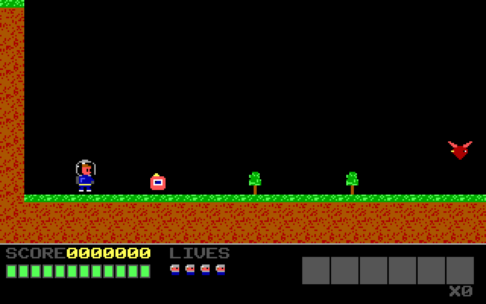
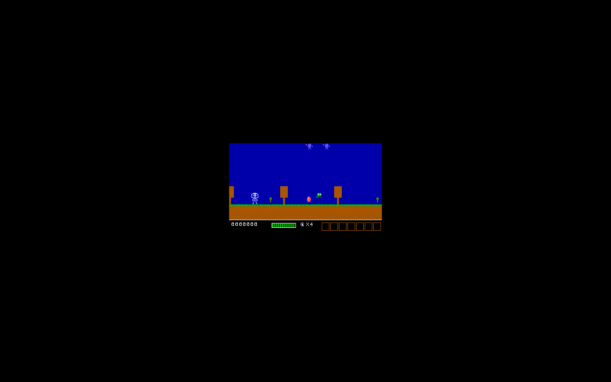
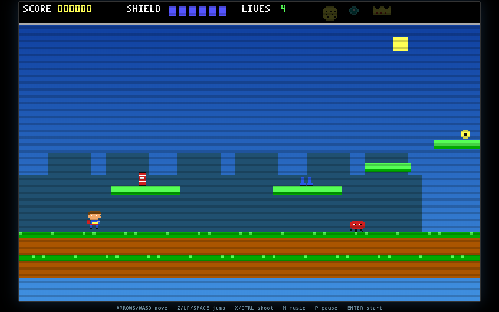
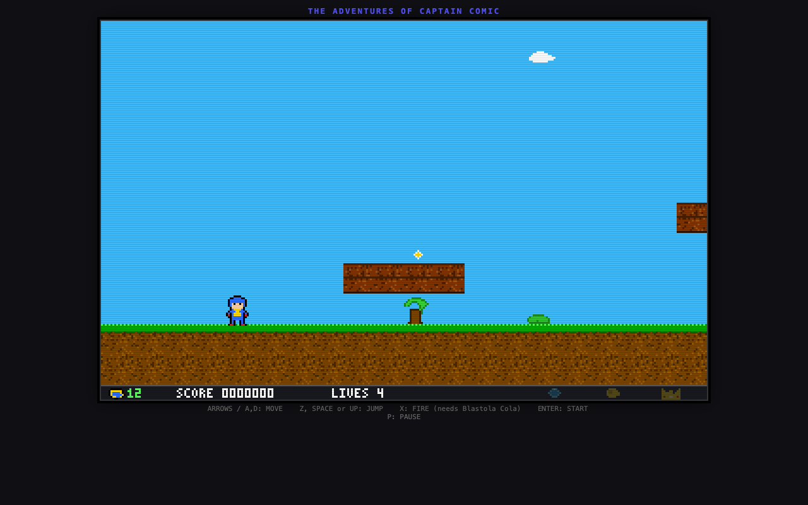
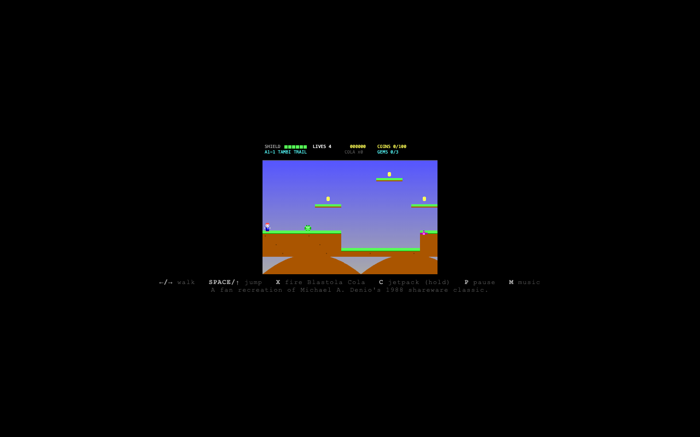
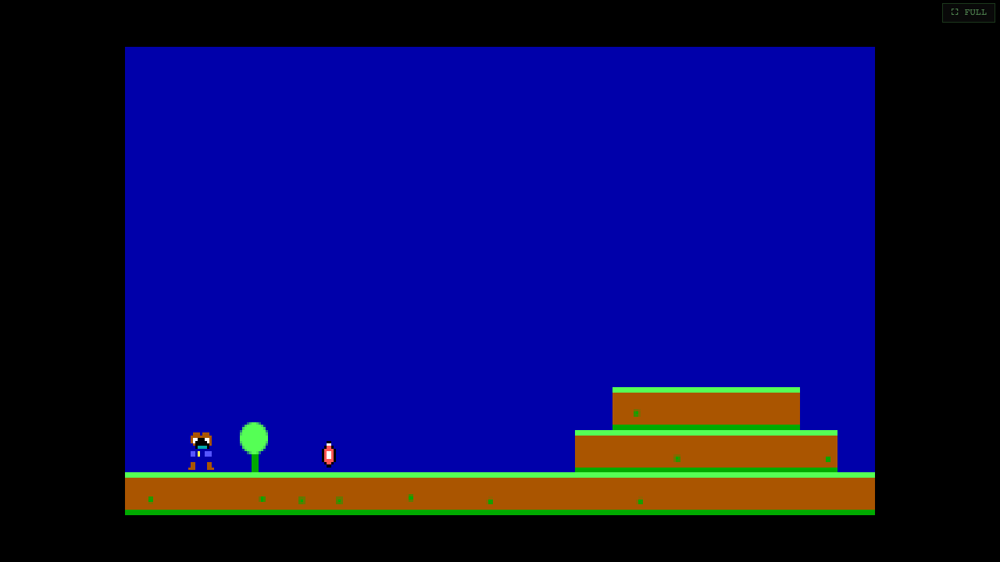

# Captain Comic: Codex artifact review

_2026-09-30. Read-only source and screenshot review of seven browser outputs. This is a quality investigation, not an agent benchmark or a complete gameplay test._

Codex CLI 0.159.2 (`gpt-6-sol`, read-only sandbox) inspected the 15 KB recreation specification (digest below), the seven HTML artifacts, recorded Duet prompts, and genuine browser captures. Its first pass grouped two runs incorrectly; a second pass verified the transcript inputs and corrected the comparison below. It ran `node --check` on the inline scripts and checked for external assets and browser storage. The files inspected were self-contained, had parseable JavaScript, and did not reference browser storage. The scores below are coarse judgments on a **0–5** scale: **S** specification coverage, **F** likely functionality from the source, **V** visible fidelity, **P** polish, **C** code quality. Functionality has lower confidence: Codex did not play the games end to end or verify audio, browser console errors, `file://` use, or frame rate.

## Shared detailed specification

Only these three artifacts are known to have received the detailed brief. The scores compare their files against that brief, not the Duet engine under controlled conditions: tools, budgets, and agent loops also differed.

| Artifact | S | F | V | P | C | Finding |
| --- | ---: | ---: | ---: | ---: | ---: | --- |
| Duet specification run | 4 | 3 | 3 | 2 | 3 | Eight zones and 24 map segments, a door graph, 14 enemy behaviors and a fixed step. The map contains **four** actual cola pickups although its comment says five. Picking up the Crown wins without checking the other two treasures. Title and story text clip in the browser. |
| GLM | 3 | 2 | 3 | 2 | 3 | Substantial sprite and world work, 24 segments and five colas. Its door graph omits the Base–Comp connection even though the map draws both doors; ordinary door traversal cannot reach Comp or Castle. Title text clips. |
| Qwen 27B | 2 | 1 | 2 | 1 | 1 | Eight named zones, but pickups reload on start and doors, not on segment crossings. The Cave lacks a Corkscrew pickup; firing does not need cola. The rendered canvas is very small. |

| Duet specification run | GLM | Qwen 27B |
| --- | --- | --- |
|  |  |  |

The Duet file is the strongest **static foundation** against the detailed brief in this set. Its visual clipping and missing progression checks mean that it is not established as a complete or best playable recreation. The images above are actual rendered captures, not mockups.

## Other Duet outputs: different or unverified inputs

The `ws-native` and `ws-zai` transcripts record the same one-line request: “recreate as close as possible The Adventures of Captain Comic game as one html page.” They did **not** receive the detailed brief. The exact input lineage of the two older Duet files has not been tied to a saved transcript. Scores below measure the files against the later detailed specification as a diagnostic only; they must not be read as a controlled comparison with the table above.

| Artifact | S | F | V | P | C | Finding |
| --- | ---: | ---: | ---: | ---: | ---: | --- |
| Duet native search | 1 | 2 | 3 | 3 | 2 | Attractive first scene, but three linear levels, four enemy kinds, a 320×208 canvas, 16-pixel HUD and colors outside EGA. |
| Duet Z.ai search | 1 | 2 | 3 | 3 | 2 | Coherent presentation, but six linear zones, 12 tile rows, an 8-pixel HUD, no door graph and no required gear route. |
| Original Duet file | 2 | 2 | 2 | 1 | 2 | Twenty-four small linear screens but different lands and mechanics. Touch buttons pass action names through a key-code lookup that cannot resolve. |
| Revised Duet file | 2 | 1 | 2 | 3 | 2 | More title and art work, but Forest segment 0 has no door, movement is clamped inside the segment, and transitions require a door. Its HUD is drawn below a 176-pixel world buffer and is absent in the capture. |

| Native search | Z.ai search | Original | Revised |
| --- | --- | --- | --- |
|  |  |  |  |

## What this says about Duet

The old weak visual comparison mostly measured **different prompts**. The `ws-native` and `ws-zai` transcripts prove that point directly. The older session investigation also found empty native search responses and an output-limit failure; those were addressed before the detailed-spec run. Those causes should not be inferred anew from the rendered files alone.

The remaining quality failure is verification. The detailed-spec Duet output implemented many requested systems but missed an item count, allowed an incomplete win condition, and clipped visible text. The revised older output shows a more severe progression block. Duet now accepts task-specific `--check` commands on a run or session and preserves them across resume. This is a way to enforce an operator-written acceptance test at `finish`; it does not automatically infer every requirement from a brief. Changing Duet's pinned agent prompt or tool flow still requires a new quality and cost evaluation.

## Reproducible acceptance check

[`tools/check-captain-comic.mjs`](../tools/check-captain-comic.mjs) runs the detailed-spec game's inline script with an inert canvas and no audio device. It inspects the actual map data and invokes the game's Crown pickup, then checks the title/story text bounds. Against the saved Duet artifact identified below, it exits 1:

```text
FAIL: expected five actual Blastola Cola pickups, found 4
FAIL: Crown grants victory without the Gems and Gold
FAIL: title text extends beyond the canvas: "ARROWS  MOVE      SPACE  JUMP (HOLD FOR HEIGHT)", "FAN RECREATION OF MICHAEL DENIO'S 1988 CLASSIC"
```

A temporary copy with those three defects corrected passed the same check; the original artifact remains unchanged. A future Duet run in that game workspace can use `duet run --check 'node check-captain-comic.mjs index.html' ...` after placing the checker there. This is a focused regression check for the detailed-spec artifact, not a full playthrough or a cross-agent benchmark. It does not test routes, HUD rendering, controls, browser console errors or frame rate; those still need browser smoke checks and a controlled rerun to establish quality gain.

## Artifact identity

The files were read at the paths below; these SHA-256 digests identify the exact source used for this review. The experiment artifacts live outside this repository, so the captures and review are included here for inspection while the raw outputs remain in the local experiment workspace.

| Artifact | Local source | SHA-256 |
| --- | --- | --- |
| Duet specification run | `experiments/comic/ws-spec/index.html` | `85de4c9fb83e358f24dfa857e75f0faffc28baa71670f0fa4c79073c66b9e734` |
| Duet native search | `experiments/comic/ws-native/captain-comic.html` | `b56d83621f13581e413e5ce91aa73fd2c8f7d0aecbb9a3c6ea5405c3dad38bda` |
| Duet Z.ai search | `experiments/comic/ws-zai/captain_comic.html` | `0cd5623141c947081c219fcac1950e3a268486ae1f2fc60c5d55f0983c0a562d` |
| GLM | `captain_comic_glm/index.html` | `bd4fe9e1fc8335d3af4a59972f7514d3b3c6a9f42eec358699c0ce241ab7e9fc` |
| Qwen 27B | `captain_comic_qwen27b/index.html` | `78cdcfb5d37b8f62f54fc57694c0fcfb1f94060854efe580eb0030f569b14981` |
| Original Duet file | `captain_comic_duet/captain_comic_clone.html` | `72a9c650603f9bae8a0a43af7fb60bcb4ed081fb9562aace7469115dd99ff5b4` |
| Revised Duet file | `captain_comic_duet/index.html` | `3bb5d4e0ee805a0b008ec0d404c3ae142f6eae3505164c3b6627467942e2b306` |
| Detailed prompt | `Downloads/captain-comic-recreation-prompt.md` | `9d824f4af2fcf0778b7ff8a087061e6ee429df25b30c2e4459a3a0fdf6943b9d` |
