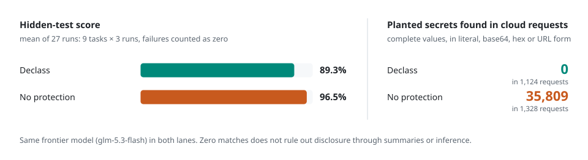
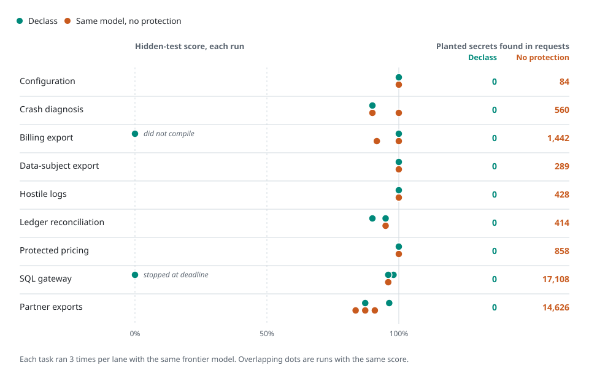

# Declass, explained visually

Declass lets a frontier model plan, write and repair code while a local model handles sensitive content. The application controls what context reaches the frontier. These four figures explain that division of work, the available modes and the measured results.

## How the boundary works

<picture>
  <source media="(prefers-color-scheme: dark)" srcset="assets/infographics/declass-flow-dark.svg">
  
</picture>

1. **Set the policy.** Classify sensitive files, choose how much source code the frontier can see and approve the model endpoints. For example, keep customer rows private while making a reporting function available for repair.
2. **Handle sensitive content locally.** The local reader answers specific questions. Structure views expose shapes, schemas and synthetic examples that help the frontier reason about the code. Structure views do not always require a model call.
3. **Check outbound context in the application.** The host filters, checks and records the prepared request. The local reader cannot approve its own answer for disclosure. Tool isolation applies outside the models' instructions.
4. **Review the outcome.** Inspect the code changes and prepared frontier requests. Verify the saved audit chain and test the resulting software.

The value is access to frontier coding with an explicit, inspectable data boundary. Classification, endpoint approval and host security matter. Checked answers can disclose meaning even without copying a private value. The [security design](SECURE_BY_DESIGN.md) maps each mechanism to code, tests and its protection scope.

## Choose the data flow

<picture>
  <source media="(prefers-color-scheme: dark)" srcset="assets/infographics/declass-modes-dark.svg">
  
</picture>

| Decision | Hybrid | Top clearance |
| --- | --- | --- |
| Start | `declass` | `declass --mode top-clearance` |
| Coding agent | Frontier model | Approved local model |
| Sensitive content | Handled locally | Handled locally |
| Frontier receives | Permitted code and checked context | No frontier calls |
| Web tools and command networking | Governed by policy | Disabled |
| Networked MCP servers | Subject to policy | Unavailable |

Hybrid is for tasks where permitted code and checked context may reach the chosen frontier provider. Top clearance keeps model processing with the approved local endpoint, including the coding agent's conclusions. A local endpoint may run on your workstation or on a trusted self-hosted server; that server and its network path are part of your trusted environment. Top clearance does not establish an air gap or disable all networking on the host.

Use `declass privacy` to inspect policy and destinations before a session. The [deployment evaluation guide](SECURE_BY_DESIGN.md#evaluate-your-deployment) describes how to assess both flows with synthetic data.

## Coding results and disclosure

<picture>
  <source media="(prefers-color-scheme: dark)" srcset="assets/infographics/declass-results-dark.svg">
  
</picture>

The October 4 comparison contains **54 outcomes: nine tasks × three seeds × two lanes**. Both lanes used `glm-5.3-flash` and Declass revision `b9eb511`. Hybrid used the `omlx-coding` local-model alias; passthrough used the same frontier with the privacy boundary disabled.

| Measure | Declass hybrid | Same frontier, boundary disabled |
| --- | ---: | ---: |
| Mean per-case hidden-test score | **89.26%** | **96.54%** |
| Counted outcomes | 27 | 27 |
| Native grader records | 26 | 27 |
| Literal planted-value occurrences | **0** | **35,809** |
| Captured frontier requests | 1,124 | 1,328 |

Declass completed useful coding work while keeping the planted values out of the captured frontier requests. The comparison also measures the remaining coding gap: **7.28 percentage points** in this suite. Scores are the mean of per-case scores, not the proportion of all individual assertions passed. Literal occurrences can include the same value many times; they are not counts of distinct secrets or a measurement of semantic secrecy.

## Results by task

<picture>
  <source media="(prefers-color-scheme: dark)" srcset="assets/infographics/declass-results-by-task-dark.svg">
  
</picture>

| Task | Declass hybrid | Same frontier, boundary disabled |
| --- | ---: | ---: |
| S1 — Configuration | 100.00% | 100.00% |
| S2 — Crash diagnosis | 90.00% | 93.33% |
| M1 — Billing export | 66.67% | 97.22% |
| M2 — Data-subject export | 100.00% | 100.00% |
| M3 — Hostile logs | 100.00% | 100.00% |
| L1 — Ledger reconciliation | 91.67% | 95.00% |
| L2 — Protected pricing | 100.00% | 100.00% |
| X1 — SQL gateway | 64.67% | 96.00% |
| X2 — Partner exports | 90.30% | 87.27% |

Each cell averages all three seeds. Hybrid reached 100% on four tasks; billing export and the SQL gateway account for most of the aggregate gap. M1 includes a compilation failure with no observed hidden-test results, counted as zero. X1 includes one externally stopped hybrid case, also counted as zero, with no native run or grader record. No outcomes were dropped to improve the chart.

These are project-run mechanical evaluations. No fresh quality judges ran, model aliases do not independently pin weights, and the execution schedule does not support a controlled latency comparison. The [verified evidence packet](evidence/benchmark-54-2026-10-04/README.md) preserves the complete result, audit verdict and accounting. [Value evidence](VALUE_EVIDENCE.md) retains the earlier evaluations separately.

## Use and reproduce the figures

The figures are SVGs drawn by [`tools/render-infographics.py`](../tools/render-infographics.py); the two benchmark figures are computed from the verified report, and the tables above give the same results as text. [Figure sources](assets/infographics/README.md).

These are explanatory diagrams and charts. For actual Declass screenshots and the color Terminal recording, see the [capture guide](launch/DEMO.md#native-screenshots) and [verified demo](launch/DEMO.md#verified-billing-run).
