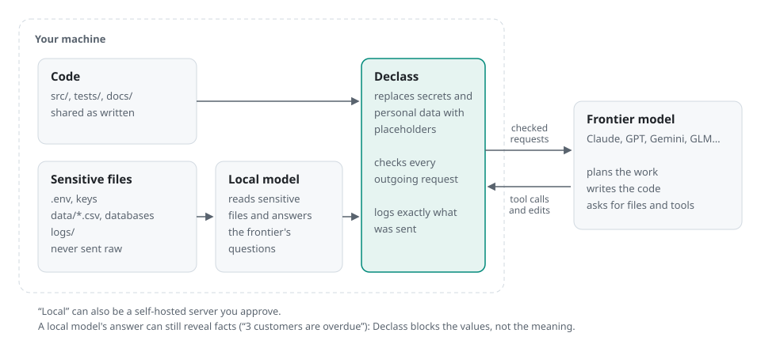

# Secure by design: inspect the boundary

Declass's design goal is to keep content classified as sensitive or protected out of the cloud frontier's context. The enforcement belongs to the host application and OS, outside the model's instructions. This document links the claim to inspectable mechanisms and tests; it is not a formal proof of security.

<picture>
  <source media="(prefers-color-scheme: dark)" srcset="assets/infographics/declass-flow-dark.svg">
  
</picture>

[Read the diagram step by step](DECLASS_VISUAL_GUIDE.md#how-the-boundary-works). The gate is part of the host application; neither model can authorize disclosure. An approved self-hosted local endpoint and its network path belong inside the trusted environment.

## Evidence you can check

| Evidence | What it establishes | What it cannot establish |
| --- | --- | --- |
| [Gate implementation](../crates/declass-boundary/src/gate.rs) | Where requests are checked and recorded | That classification recognizes every sensitive value |
| [Adversarial transport tests](../crates/declass-cli/tests/privacy_scenarios.rs) | What a scripted frontier actually receives under specific attacks | Every possible model behavior or side channel |
| [Frozen paired development benchmark](VALUE_EVIDENCE.md) | Measured disclosure and coding outcomes; separately dated historical quality, cost and timing results | Universal frontier parity, cost savings or an independent assessment |
| [New live dogfood and original audit](launch/DEMO.md) | Actual model execution, the code change, acceptance tests and recorded outbound content | Provider receipt, exhaustive traffic capture or production readiness |
| [Failed dogfood and its regression](evidence/launch-2026-10-01/regression-before.txt) | A concrete disclosure path, found and reproduced before the fix | That fixing it eliminates all disclosure paths |

The first launch run exposed arbitrary customer values through a diagnostic preview. Its audit chain was intact: **an intact log proves integrity of the record, not safety of the content.** The [before/after packet](launch/DEMO.md#what-the-first-run-found) is part of the evidence, not discarded demo footage.

## 1. Outbound requests have one checked path

`OutboundGate` constructs `GatedFrontier`; the agent receives the gated interface. Text is filtered, checked, then recorded before sending. The check includes tool arguments and replayed context, not just the latest user message. A refused part may be withheld and the remainder rechecked; a request that cannot be cleared fails.

- Code: [gate](../crates/declass-boundary/src/gate.rs), [outbound filtering](../crates/declass-boundary/src/engine/outbound.rs), [CLI composition](../crates/declass-cli/src/lib.rs).
- Tests: [outbound gate](../crates/declass-cli/tests/outbound_gate.rs), [filter/check agreement](../crates/declass-boundary/tests/outbound_agreement.rs), [provider dialects](../crates/declass-boundary/tests/dialect_gate.rs).
- Limit: known-value checks cannot catch a value that no layer recognizes. A summary can disclose meaning without quoting a secret.

## 2. Tool permissions live outside the model

Ordinary commands cannot read sensitive paths, Git history, Declass state or configured credential stores. Commands that explicitly require sensitive data use a different path: network disabled, output retained behind a handle, and derived files treated as sensitive. macOS uses Seatbelt; Linux uses bubblewrap with seccomp. The operator's host remains trusted.

- Code: [sandbox](../crates/declass-sandbox/src/lib.rs), [sensitive-file handling](../crates/declass-boundary/src/engine.rs).
- Tests: `a_sensitive_data_command_cannot_read_the_vault`, `a_file_derived_by_a_sensitive_data_command_stays_sensitive_when_read`, and `a_file_derived_into_target_stays_sensitive_when_read` in [privacy scenarios](../crates/declass-cli/tests/privacy_scenarios.rs).
- Network evidence: [sandbox network tests](../crates/declass-sandbox/tests/network.rs), [independent egress-oracle scenarios](../crates/declass-cli/tests/egress_oracle.rs). Those are separate from the new demo's audit inspection.
- Limit: normal registry access is allowed by default. `sandbox.network = "off"` tightens that. Do not describe hybrid mode as air-gapped.

## 3. The repository cannot promote its own permissions

Repository content is untrusted. Project config can tighten policy but cannot choose owner endpoints, credentials or looser privacy settings. An explicitly configured policy must load successfully; failure does not silently remove it. Core's policy file is unsigned; a deployment must protect it or supply a verifying policy source.

- Code and tests: [configuration](../crates/declass-config/src/lib.rs), [policy implementation](../crates/declass-config/src/policy.rs), [CLI secure defaults](../crates/declass-cli/tests/secure_defaults.rs).
- Reproduce: `cargo test --locked -p declass-config` and `cargo test --locked -p declass-cli --test secure_defaults`.
- Limit: this is not a shipped fleet-management, identity or policy-signing service. The trusted owner can change policy; a compromised owner account is outside the boundary.

## 4. The local model is not a trusted declassifier

In hybrid mode the local reader has no agent tools and cannot decide the next action. Its output passes copied-span, known-value and encoding checks. Probe budgets limit repeated attempts to recover values. Protected code can be worked on locally while the frontier receives allowed interfaces and test outcomes.

- Code: [local reader](../crates/declass-boundary/src/local.rs), [engine](../crates/declass-boundary/src/engine.rs), [protected-code path](../crates/declass-boundary/src/engine/protected.rs).
- Tests: careless-local scenarios cover direct copying, digit fragments, spelled-out values and encoding; [structure tests](../crates/declass-boundary/tests/structure_views.rs) cover shapes and synthetic data.
- New regression: `error_words_in_customer_data_do_not_publish_rows_as_diagnostics` captures the frontier transport and asserts that the dogfood's ID, reserved-domain email, name and amount do not arrive. The boundary regression also covers repeated rows with structure views disabled. A second live failure led to `local_digest_cannot_quote_short_structured_values`, which checks amounts and identifiers repeated by a local digest. This extra matcher covers structured values of at least four characters up to the existing per-run index cap; it is not a guarantee for every scalar, fragment or paraphrase.
- Limit: semantic leakage, inference from structure and unknown value formats remain relevant. Open source files are cloud-visible unless marked otherwise.

## 5. Top clearance removes the frontier

`declass --mode top-clearance` makes the configured local model the coding agent. Web tools and command networking are disabled; networked MCP servers are not offered. `clearance.required = "top"` prevents a session from switching to hybrid or passthrough for that repository.

- Tests: `only_the_local_model_works_and_nothing_leaves`, `a_repository_can_require_top_clearance`, and `a_session_continues_in_top_clearance_and_cannot_leave_it` in [top-clearance scenarios](../crates/declass-cli/tests/top_clearance.rs). The tests use a frontier trap endpoint and assert it receives nothing.
- [Live local-model task](launch/DEMO.md): separate from those scripted tests.
- Limit: “local” is the configured endpoint, which can be a remote self-hosted machine. Top clearance is not a guarantee of same-device processing, no networking anywhere on the host, or frontier-level quality. The launch changes correct the TUI banner to describe disabled frontier/web/command networking; a self-hosted LAN endpoint still receives local-model requests.

## 6. Audit records are inspectable and tamper-evident

Declass records outbound request bodies, hashes and boundary events in a chain whose head is anchored outside the repository. You can inspect the exact prepared request, run verification and review disclosure counts. CLI verification checks the anchor as well as internal chain consistency.

```sh
declass audit show <run-id>
declass audit verify <run-id>
declass audit disclosure <run-id>
```

- Code: [audit implementation](../crates/declass-boundary/src/audit.rs).
- Tests: `chain_verifies_and_detects_tampering`, `anchor_detects_a_rewritten_or_truncated_log`, and the [CLI rewrite test](../crates/declass-cli/tests/secure_defaults.rs).
- New observation: [live verification and deliberate corruption of a copy](launch/DEMO.md).
- Limits: the record is not an acknowledgement from the provider. Someone controlling both log and anchor can rewrite both. Local transcripts/handles can contain sensitive content; top-clearance audit bodies can contain raw requests to the local model. A disclosure bug can also leave sensitive content in a hybrid audit. Protect storage, backups and access. Tamper evidence is not encryption or an immutable external archive. A session's disclosure report can lack per-result counts when no run `summary.json` exists; do not mistake that for a zero.

For metadata-only exports, retention, integrity alerts and preview commands, see
[operations](OPERATIONS.md). Full request logs can contain sensitive content;
metadata exports do not replace the original evidence or independent custody.

## Evaluate your deployment

Start with an isolated project and invented data. Declass is a development preview;
passing a synthetic task does not approve private production data or certify a
deployment. The host, owner configuration and approved model infrastructure remain
part of the trust decision.

| Data flow | What to evaluate |
| --- | --- |
| Hybrid with a workstation model | Sensitive-file classification, inferred facts in summaries, frontier provider retention, and tool egress |
| Hybrid with a self-hosted local endpoint | The same checks plus server access, logging, backups, transport and data residency |
| Top clearance with an approved local endpoint | Local coding results, endpoint trust, pre-staged dependencies and host-level network observation; no frontier, web tools or command networking |

“Local” does not by itself establish same-device processing or encryption. The
[launch demo](launch/DEMO.md) used fictional data on an explicitly allowed plaintext
LAN connection; it demonstrates neither production transport nor endpoint trust.

1. **Record the environment.** Keep source/binary hashes, OS, policy, endpoints,
   model identifiers and dependency versions. Identify who owns the setup and
   reviews the results.
2. **Run a task with acceptance tests.** Reproduce the
   [billing fixture](launch/DEMO.md#reproduce-the-task), inspect its patch and
   preserve failures as well as successful attempts.
3. **Observe disclosure independently.** Compare captured requests with the
   [planted-value checker](../tools/check-launch-canaries.py), and inspect summaries
   for private meaning beyond literal matches. Exercise hostile instructions,
   encoded values, derived files and repeated questions with the
   [privacy scenarios](../crates/declass-cli/tests/privacy_scenarios.rs) and
   [egress tests](../crates/declass-cli/tests/egress_oracle.rs).
4. **Check audit custody and recovery.** Tamper with a copy and verify rejection
   against a preserved anchor. Test missing logs and retention behavior. The
   recorded timestamp comes from the host, not a trusted external clock; a person
   controlling both log and anchor can replace both. Protect full logs and backups.
5. **Repeat without the frontier.** Use top clearance with a receiving trap and
   host network observation. Check unavailable-local-endpoint behavior and assess
   its coding results separately.
6. **Decide for this setup.** Record allowed flows, failures, residual risks,
   operating costs and exclusions. Evaluate the real workloads and OS/extensions
   you intend to use; do not generalize from a synthetic success.

| Decision | Available evidence | Work for your deployment |
| --- | --- | --- |
| Disclosure and tool isolation | Boundary mechanisms above; retained [failed and fixed runs](launch/DEMO.md) | Classification coverage, semantic inference, endpoint/OS checks and independent adversarial assessment |
| Policy ownership | Owner/project separation and configuration audit | Protect and distribute policy; Core does not supply fleet identity or a policy-signing service |
| Investigation and retention | Request/event records, anchors and [operational checks](OPERATIONS.md) | Access controls, encryption, retention, backups, alert routing and custody outside the workspace |
| Trusted installation and response | Source, lockfile, [release procedure](INSTALLATION.md) and [advisories](../SECURITY.md#advisories-and-fixed-leak-classes) | Verify signing identity and provenance, plan updates/rollback, establish a working private reporting route and incident response |
| Useful coding results | [54-outcome mechanical comparison](evidence/benchmark-54-2026-10-04/README.md), real TUI dogfood and separately dated [historical judged results](VALUE_EVIDENCE.md) | Representative acceptance tasks, human review and actual latency/cost; no fresh quality judges or controlled timing comparison in the current benchmark |

The earlier institution-specific research references and their October 1 source
check remain in the [pre-consolidation evaluation guide](https://github.com/maximpri/duet/blob/9b0ac104ba6947e338ca3baacfd31de2c2823e83/docs/INSTITUTIONAL_EVALUATION.md).
They are historical evaluation context, not certification or an endorsement.
