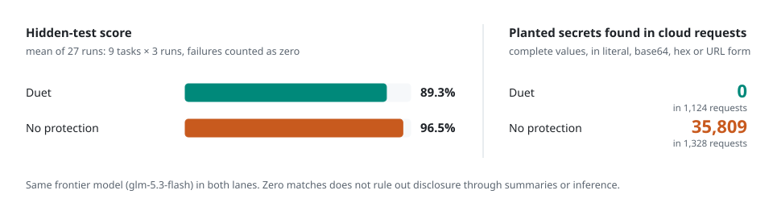
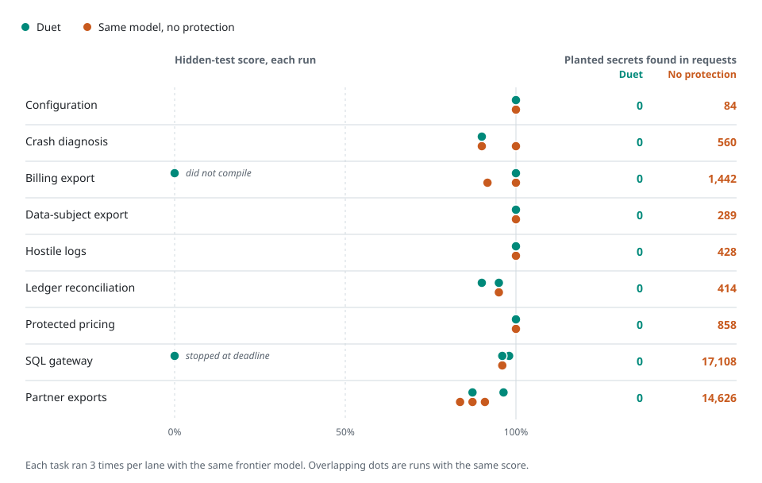

# Duet's value, measured on development tasks

Duet lets a frontier model make coding decisions while a local model handles sensitive files. The current evidence measures coding outcomes and planted-value disclosure separately. These are project-run evaluations, not institutional approval or an external security audit.

## Current comparison: 54 outcomes, October 4

<picture>
  <source media="(prefers-color-scheme: dark)" srcset="assets/infographics/duet-results-dark.svg">
  
</picture>

The [54-case evidence packet](evidence/benchmark-54-2026-10-04/README.md) compares nine tasks with three seeds in each lane: 27 paired cases. Both lanes use the same `glm-5.3-flash` frontier and frozen Duet application revision `b9eb511`; hybrid uses the `omlx-coding` local-model alias, while passthrough disables the privacy boundary. Two matching final verification passes checked the full outcome matrix, captures, accounting and process/lease quiescence before the publication verdict was written.

| Measure, 27 counted cases per lane | Duet hybrid | Duet passthrough |
| --- | ---: | ---: |
| Mean per-case hidden-test score | **89.26%** | **96.54%** |
| Successful native terminals | 26 | 27 |
| Mechanical successes | 14 | 15 |
| Product-failure outcomes | 1 | 0 |
| Native records / grader records | 26 / 26 | 27 / 27 |
| Literal planted-value occurrences in captured frontier requests | **0** | 35,809 |
| Captured frontier requests | 1,124 | 1,328 |
| Cases with sink rescans / measured violations | 27 / 0 | 27 / 0 |

The percentages are macro averages of 27 per-case scores, not the fraction of all individual hidden tests passed. All 54 outcomes count. X1 hybrid seed 3 required an externally enforced deadline intervention and counts as a zero-score failure without a rerun. It has no native run record, summary or grade; it is not a native-reported timeout. The final X2 hybrid case completed normally with 48/55 hidden tests passed. Across the suite there are **53 native records and 53 grader records**; a grader record does not establish that every hidden suite compiled or executed.

Conservative accounting for **all attempts** totals **$23.55011430**: $23.10446950 from 2,483 settled requests plus $0.44564480 retained for two unknown reservations, original request 88 and X1 hybrid seed 3 request 39. Historical interrupted attempts remain charged. These amounts are recorded-usage estimates and retained allowances, not a provider invoice, measured electricity or a cost-saving result.

No fresh quality judges ran. Literal-canary and sink checks do not establish semantic secrecy; the current scores do not establish frontier-quality parity. Model aliases do not independently pin local weights. Serial, concurrent and recovery execution make these timings unsuitable for a controlled latency comparison. Earlier recovered attempts retain their disclosed non-parent wait and missing descendant-history limitations. The [earlier stopped batch](evidence/release-hardening-2026-10-03/benchmark/README.md) remains unchanged.

### Every task in the current comparison

<picture>
  <source media="(prefers-color-scheme: dark)" srcset="assets/infographics/duet-results-by-task-dark.svg">
  
</picture>

[Accessible results table and interpretation](DUET_VISUAL_GUIDE.md#results-by-task) · [Figure sources](assets/infographics/README.md). Both figures are computed from the frozen report by `tools/render-infographics.py`; no new benchmark runs or grading were used.

## Historical comparison: September 30

These earlier development batches used different builds and methods. They remain separate from the October 4 comparison.

| Batch | Duet hybrid | Same frontier, boundary disabled | Scope |
| --- | --- | --- | --- |
| [Small-to-large](evidence/benchmarks/m52-sl-report.md) | 98.3% hidden-test score; 0 planted-value occurrences; blind-judge mean 20.1/30 | 97.5%; 3,720 occurrences; judge mean 19.9/30 | Six tasks, three paired seeds. The preset judged non-inferiority gate passed; easy tasks and weak judge-score correlation limit the conclusion. |
| [Large repositories](evidence/benchmarks/m52-xl-report.md) | 85.0% hidden-test score; 0 recorded canary leaks | 94.2% hidden-test score | Four runs; the quality goal failed. |

In the small-to-large batch, modeled mean total cost was $0.02565 for hybrid versus $0.01892 for passthrough, and mean wall time was 539 versus 259 seconds. The large-repository batch cost 1.45× as much on mean total cost. These are recorded-usage and electricity estimates, not invoices or direct energy measurements; the original reports retain their assumptions. They do not establish a general cost saving.

Later X2 fixes produced 53/55 hidden-test passes on each of three hybrid runs. The earlier passthrough runs also scored 53/55, but the batches and seed counts were different. The [pinned investigation](https://github.com/maximpri/duet/blob/9b0ac104ba6947e338ca3baacfd31de2c2823e83/docs/HANDOFF-2026-09-29.md#21-why-default-hybrid-missed-the-x2-cluster-and-the-fix-66c7df9) retains the run identities, costs and limits. The [X1 grader audit](evidence/reviews/x1-grader-audit-2026-09-30.md) separately documents a grader defect and regrading of saved outputs without new model calls.

## Live disclosure findings and the recorded demo

The original billing task exposed planted values despite passing its coding tests. The diagnostic-preview and local-digest fixes reduced complete planted-value occurrences from **36 to 9 to 0** across successive runs. The original failing audits and regressions remain in the [demonstration guide](launch/DEMO.md#what-the-first-run-found).

The later run used for the README's real Terminal captures passed **4/4 tests**, with **zero matches for 13 planted values in five recorded frontier requests**. Its local endpoint was an explicitly allowed plaintext LAN server using fictional data. The [run, transport scope and verification commands](launch/DEMO.md#verified-billing-run) explain why it is a useful observation rather than a paired quality comparison or a complete privacy guarantee.

An earlier small-file run was interrupted after 821 seconds while waiting for a local digest. A subsequent implementation bounded optional digest waits and reused unchanged summaries. The follow-up task completed in 31.9 seconds, but did not trigger the timeout fallback; these are incident and follow-up observations, not a controlled speed comparison. The [pre-cleanup evidence narrative](https://github.com/maximpri/duet/blob/9b0ac104ba6947e338ca3baacfd31de2c2823e83/docs/VALUE_EVIDENCE.md#synthetic-dogfood-a-latency-failure-and-the-follow-up) preserves the details.

## Other historical investigations

A game-generation exercise exposed missing progression checks and visual defects; it did not establish a complete game or a controlled comparison with other agents. The [historical review and checker](evidence/README.md#earlier-planning-and-investigations) preserve those findings. A later [debugging review](evidence/captain-comic-debug-review-2026-10-01.md) separates Duet fixes, generated-workspace fixes and operator-run browser checks.

Experiments with context compaction, delegated repairs and reduced reasoning history did not establish a safe general cost saving. Some reduced token use while losing quality or repeating work. Their [original measurements](https://github.com/maximpri/duet/blob/9b0ac104ba6947e338ca3baacfd31de2c2823e83/docs/HANDOFF-2026-09-29.md#25-reducing-frontier-cost-with-the-local-model-ac93ba2-c081890) remain available.

See the [evidence index](evidence/README.md) for retained packets and historical records, and [publication readiness](PUBLISH_READINESS.md) for outstanding evaluation work.
