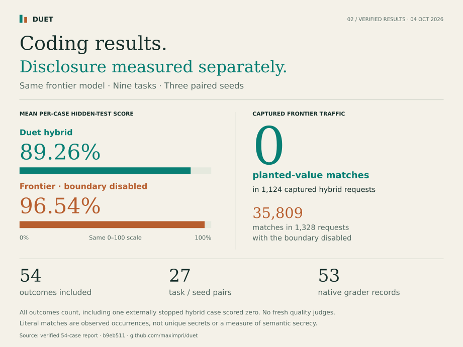
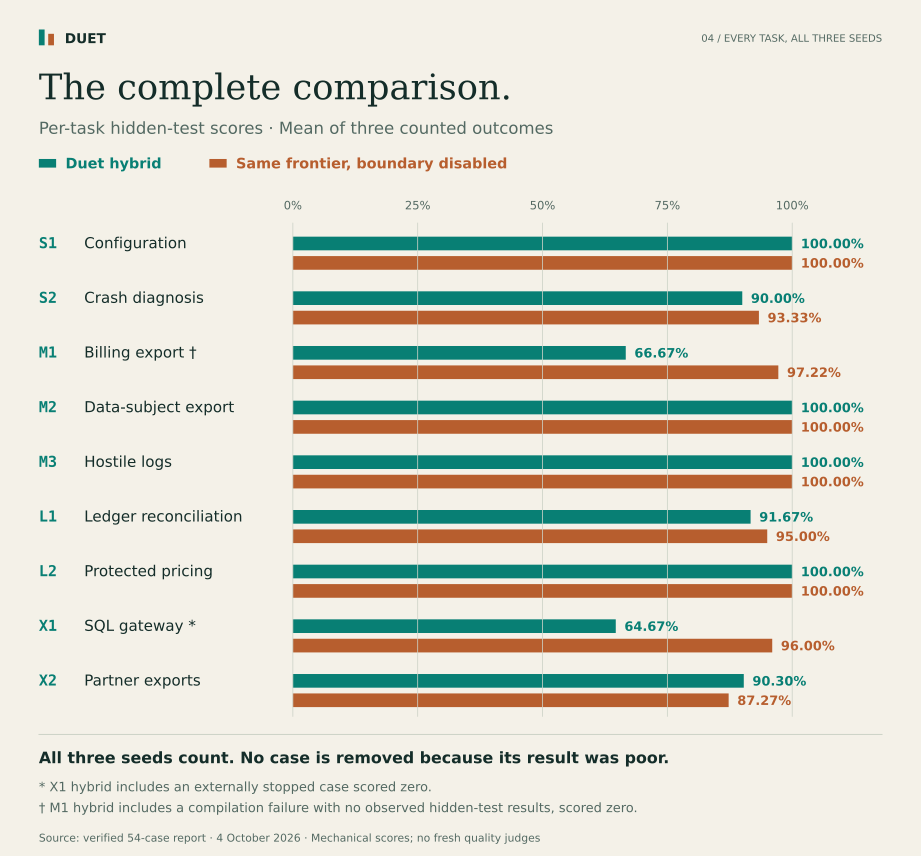
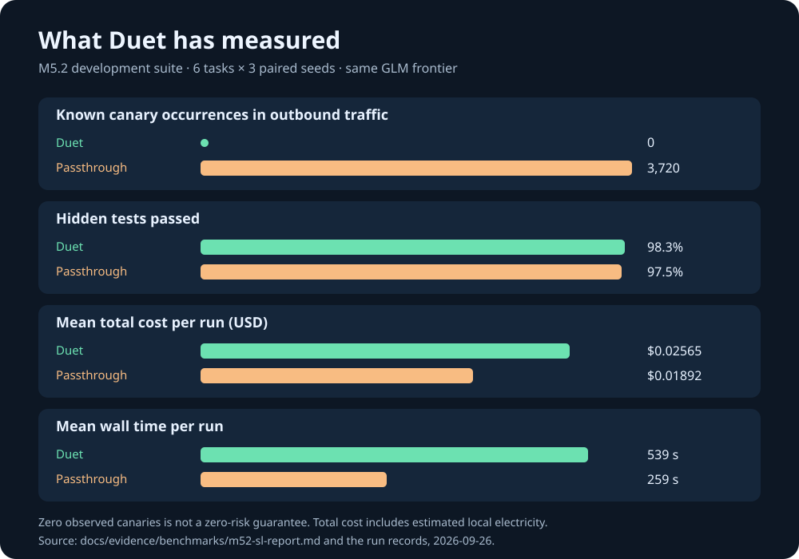
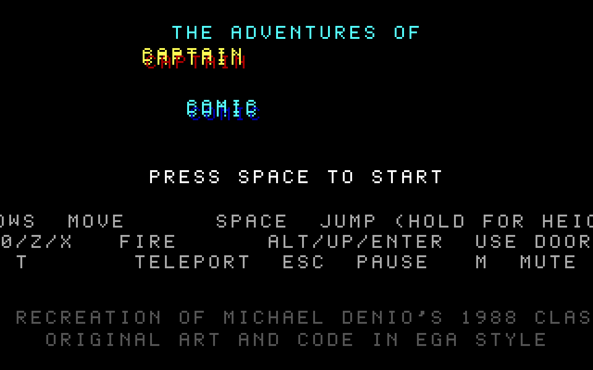
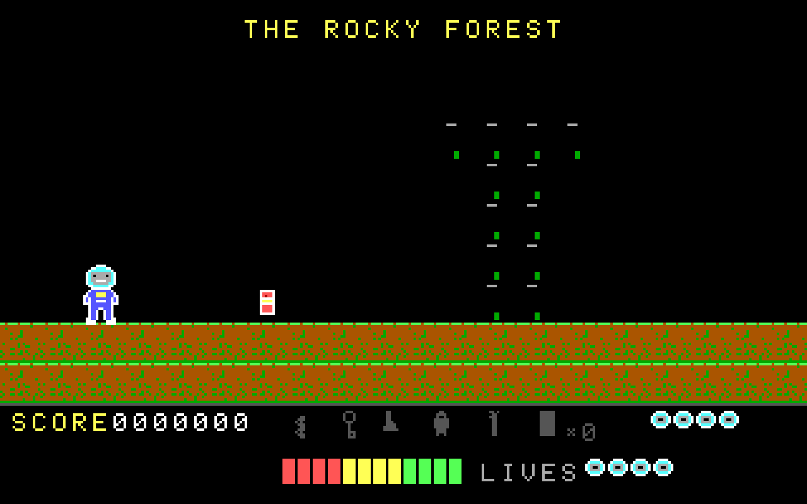

# Duet's value, measured on development tasks

Duet lets a frontier model make coding decisions while a local model handles sensitive files. The current evidence measures coding outcomes and planted-value disclosure separately. These are project-run evaluations, not institutional approval or an external security audit.

## Current comparison: 54 outcomes, October 4

The [54-case evidence packet](evidence/benchmark-54-2026-10-04/README.md) compares nine tasks with three seeds in each lane: 27 paired cases. Both lanes use the same `glm-5.3-flash` frontier and frozen Duet application revision `b9eb511`; hybrid uses the `omlx-coding` local-model alias, while passthrough disables the privacy boundary. Two matching final verification passes checked the full outcome matrix, captures, accounting and process/lease quiescence before the publication verdict was written.

| Measure, 27 counted cases per lane | Duet hybrid | Duet passthrough |
| --- | ---: | ---: |
| Mean per-case hidden-test score | **89.26%** | **96.54%** |
| Successful native terminals | 26 | 27 |
| Mechanical successes | 14 | 15 |
| Product-failure outcomes | 1 | 0 |
| Native records / grader records | 26 / 26 | 27 / 27 |
| Literal planted-value occurrences in captured frontier requests | **0** | 35,809 |
| Captured frontier requests | 1,124 | 1,328 |
| Cases with sink rescans / measured violations | 27 / 0 | 27 / 0 |

The percentages are macro averages of 27 per-case scores, not the fraction of all individual hidden tests passed. All 54 outcomes count. X1 hybrid seed 3 required an externally enforced deadline intervention and counts as a zero-score failure without a rerun. It has no native run record, summary or grade; it is not a native-reported timeout. The final X2 hybrid case completed normally with 48/55 hidden tests passed. Across the suite there are **53 native records and 53 grader records**; a grader record does not establish that every hidden suite compiled or executed.

Conservative accounting for **all attempts** totals **$23.55011430**: $23.10446950 from 2,483 settled requests plus $0.44564480 retained for two unknown reservations, original request 88 and X1 hybrid seed 3 request 39. Historical interrupted attempts remain charged. These amounts are recorded-usage estimates and retained allowances, not a provider invoice, measured electricity or a cost-saving result.

No fresh quality judges ran. Literal-canary and sink checks do not establish semantic secrecy; the current scores do not establish frontier-quality parity. Model aliases do not independently pin local weights. Serial, concurrent and recovery execution make these timings unsuitable for a controlled latency comparison. Earlier recovered attempts retain their disclosed non-parent wait and missing descendant-history limitations. The [earlier stopped batch](evidence/release-hardening-2026-10-03/benchmark/README.md) remains unchanged.

### Every task in the current comparison

[Accessible results table and interpretation](DUET_VISUAL_GUIDE.md#results-by-task) · [Download or reproduce the figures](assets/infographics/README.md). The charts read the frozen report directly; no new model runs or grading were used to create them.

## Historical comparison: September 30

_The following chart and results preserve the earlier development batches. They are not the October 4 comparison._

## What was compared

The M5.2 small-to-large batch ran six tasks with three paired seeds each (18 runs per lane). Both lanes used the same `glm-5.3-flash` frontier and Duet's agent loop. The hybrid lane used local Qwen 3.8 27B for sensitive content; the passthrough lane gave the frontier direct access. Synthetic secrets and personal data were planted in the tasks. An independent logging proxy captured outbound traffic, hidden tests graded the solutions, and two model families (Claude and Codex) judged the artifacts without lane names. The [frozen batch report](evidence/benchmarks/m52-sl-report.md) gives the lane means, per-task cost profile, judge disagreement, and gate outcomes; [the suite definition](DOGFOOD_SUITE.md) explains the tasks and protocol.

| Measure, 18 paired runs per lane | Duet hybrid | Duet passthrough | Interpretation |
| --- | ---: | ---: | --- |
| Known canary occurrences in outbound traffic | **0** | 3,720 across all 18 runs | The observed privacy boundary held for the planted values. Zero in 18 runs leaves a 15.3% exact 95% upper bound on the per-run leak rate; it is not a proof of zero risk. |
| Hidden tests passed | **98.3%** | 97.5% | Near parity in this suite. Most of these tasks were easy for the frontier baseline, so the suite has limited power to separate quality. |
| Blind judges' mean, out of 30 | **20.1** | 19.9 | The preset non-inferiority gate passed. The two judges' scores correlated weakly (0.10), so small score differences should not be read as a win. |
| Mean modeled total cost per run | **$0.02565** | $0.01892 | Duet cost **1.36×** as much. Its mean frontier portion alone was $0.02238 versus $0.01892; local electricity added an estimated $0.00327. |
| Mean wall time per run | **539 s** | 259 s | Duet took **2.08×** as long. |

Costs are estimates from recorded provider token usage at the prices frozen for this evaluation, plus a wattage-based local electricity estimate charged on the local lane's **whole run wall time**. A local timeout therefore still contributes to the electricity estimate. This can overstate actual model busy time. Current runs flag canceled local requests whose in-flight token charge is unknown; the frozen batches predate that counter. These are neither invoices nor a measurement of energy drawn by the local process. Duet Core's source license has no software fee; model access, hardware, electricity, and operator time still cost money.

**Accounting update after this frozen batch.** New runs count elapsed time for every local request, including errors and cancellation. The evaluation harness uses that time for electricity only when the summary marks it complete, capped at run wall time; older runs retain the wall-time upper bound. As a separate sensitivity calculation, the 18 archived hybrid runs report a mean 207.06 seconds in completed local requests versus 538.89 seconds of run time. Replacing wall time by those recorded request seconds would change the mean modeled total from $0.02565 to **$0.02363**, or **1.25×** the unchanged $0.01892 passthrough mean. Archived request timing can omit failed or canceled calls, so $0.02363 is a lower scenario, not a corrected benchmark or a new energy measurement. Duet still costs more than the same frontier alone in either calculation.

## Harder repositories and later fixes

The first XL batch used two real open-source codebases with sensitive task data. Its default hybrid passed 85.0% of hidden tests versus 94.2% for passthrough across four runs; it had zero recorded leaks but cost 1.45× as much on mean total cost. That **failed the quality goal**. [The original XL report](evidence/benchmarks/m52-xl-report.md) preserves this result.

The X2 failure was traced to specific evidence being omitted from the sanitized log view. After Duet showed one example per error shape, preserved calendar years, and allowed the local answer to quote material already public or already shown, the default hybrid passed **53/55 hidden tests in all three new X2 runs**, with zero known canary leaks. The earlier passthrough baseline passed **53/55 in both runs**. The new hybrid mean total cost was **$0.29742** against the earlier passthrough mean of **$0.26661** (about **1.12×**); mean wall time was 2,414 s against 1,922 s. These are different batches and seed counts, so the ratio describes observed means and is not a paired gate. [The investigation and run IDs](HANDOFF-2026-09-29.md#21-why-default-hybrid-missed-the-x2-cluster-and-the-fix-66c7df9) record the cause and fix.

The X1 hidden grader then proved to reject valid PostgreSQL parenthesization. Regrading **saved artifacts without new model calls** under revision 2 gives Duet hybrid **49/49/48 of 50** on three later seeds and passthrough **48/49 of 50** on two earlier seeds. This corrects the quality description; it is not a newly paired experiment. [The PostgreSQL proof, revised seal, and all 20 regraded artifacts](X1-GRADER-AUDIT-2026-09-30.md) document the correction.

## A real build, with its limits

Duet was also asked to make a single-file Captain Comic recreation from a detailed 15 KB specification. The resulting HTML was opened in a browser; these are real captures from that file, not a generated mockup or fixture render. The title and first Forest screen show that the file runs. They do **not** establish that the full game meets the specification or wins a comparison with other agents.

| Title screen | First Forest screen |
| --- | --- |
|  |  |

The run used 60 frontier turns, about $0.27 in modeled frontier cost, and about 42 minutes. It hit an output limit once and then wrote the file in parts. There were no local-model calls in this public-code task: the screenshots demonstrate the coding workflow, not the privacy boundary. The original short-prompt Duet build received a different task from the GLM and Qwen versions; comparing their visuals as if they had the same brief would overstate an engine gap. The [session investigation](HANDOFF-2026-09-29.md#24-captain-comic-why-duets-build-was-weakest-40aec4f) separates prompt mismatch, blocked research, and the output-limit failure. The raw artifact and prompt remain in the local experiment directory; SHA-256 digests are recorded below so a later review can identify the exact inputs.

A [Codex review of all seven Captain Comic artifacts](CAPTAIN_COMIC_REVIEW.md) checks the specification and the source behind the captures. The screenshots show the rendered output, including its rough edges; they are not a claim that the game is complete.

A task-specific [acceptance script](../tools/check-captain-comic.mjs) executes the saved Duet game's map and pickup logic with silent, inert graphics. It fails on three concrete defects: four actual cola pickups instead of five, victory from the Crown without the other treasures, and title text outside the canvas. Duet now lets an operator attach such a command with `--check` to block `finish` until it passes. This proves the defects are detectable without a second model call; it does not prove that Duet would repair them in a new run or improve its benchmark score.

| Captain Comic artifact | SHA-256 |
| --- | --- |
| Detailed prompt (`captain-comic-recreation-prompt.md`) | `9d824f4af2fcf0778b7ff8a087061e6ee429df25b30c2e4459a3a0fdf6943b9d` |
| Duet HTML (`ws-spec/index.html`) | `85de4c9fb83e358f24dfa857e75f0faffc28baa71670f0fa4c79073c66b9e734` |
| Browser title capture | `a45bff049a130697de549a2717a6244cf9eb6c018bb9cc8f82e4c6fc8060589b` |
| Browser Forest capture | `55e64ca16f8450e40384e9db3d9a27c78ca31f64ad9a7565c0d40af569b42f3e` |

## Synthetic dogfood: a latency failure and the follow-up

On 2026-09-30, a hybrid Duet session read a two-row customer CSV to learn its column shape. The deterministic structure was available, but `read_file` waited for a local-model digest. The operator interrupted that first run after **821 seconds**; the requested code fix and test never ran.

The engine now bounds an optional local digest to 60 seconds for files up to 4 KiB, 180 seconds up to 60 KiB, and 600 seconds above that. If it times out, the handle and deterministic structure remain available, and the agent can ask the local model a specific question later. Successful digests of unchanged content are reused within a run. Tests cover a stalled local endpoint returning a structure view without private values, plus reuse and invalidation of the digest cache. These tests establish the fallback behavior; they do not measure its effect on solution quality.

The same synthetic task was rerun with the updated release binary as run `20260930-213904-efd0c6`. It finished in **31.9 seconds** and **4 frontier turns** at **$0.00114 modeled frontier cost**. One local digest took **6.6 seconds**; the agent changed the function to compare the status field exactly, and `cargo test` passed. That run did **not** trigger the timeout, so the two wall times are incident and follow-up observations, not a controlled latency comparison. The local endpoint for this dogfood was an owner-configured remote HTTP host with plaintext explicitly allowed; sensitive fixture bytes therefore crossed the LAN without TLS. The CSV held fictional test values. Neither dogfood run enters the benchmark tables above.

## October 1 launch dogfood: new disclosures and fixes

A later live billing task passed its coding tests while disclosing planted customer IDs, reserved-domain emails and monetary amounts. A diagnostic preview treated `.invalid` inside an email as an error line. Restricting that preview exposed a second gap: the local digest copied short structured amounts. Both paths now have regressions and fixes. Across four frontier requests per run, the independent launch checker counted **36 complete planted-value occurrences before the fixes, 9 after the preview fix alone, and 0 in the final rerun**. All values were fictional; the local endpoint was explicitly configured on a plaintext LAN connection.

The [original audits, failed regression, live TUI recordings and final proof packet](launch/DEMO.md) preserve the observations. This does not change the historical benchmark measurements or prove all disclosure classes are covered. It shows why their zero-canary result must remain scoped to that frozen suite. The new task is a dogfood observation, not a new paired quality/cost benchmark.

## Historical cost experiments

The [October 1 debug-log review](evidence/captain-comic-debug-review-2026-10-01.md)
identified repeated tool misuse, misleading session failures and simulated screenshots
presented as visual checks. Recovery guidance, session status and verification instructions
were repaired, and the generated workspace was checked in a real muted browser. This changed
the agent prompt; no paired quality/cost benchmark was rerun for that revision.

The large tasks spend most frontier dollars on input context carried across many requests. Three measured ideas did not produce a safe saving: removing old tool results saved only 0–2% in offline replays; delegating fix loops had little eligible work; and dropping the frontier's earlier reasoning caused repeated work, higher cost, and wall-clock stops in live X2 runs. Local compaction reduced token spend on some runs but lost X2 quality on two seeds and collapsed one X1 run. The local explorer was almost never called. [The experiment table](HANDOFF-2026-09-29.md#25-reducing-frontier-cost-with-the-local-model-ac93ba2-c081890) gives the measurements.

The current product claim is frontier coding with local handling of sensitive context and inspectable disclosure controls. The October 4 comparison records zero literal planted-value matches in the hybrid lane alongside its lower mean hidden-test score; it supports neither universal secrecy nor quality parity or cost savings. Representative deployment acceptance, fresh adversarial evaluation and an independent security review remain separate work. See [publication readiness](PUBLISH_READINESS.md) and the [historical acceptance ledger](ACCEPTANCE.md).
