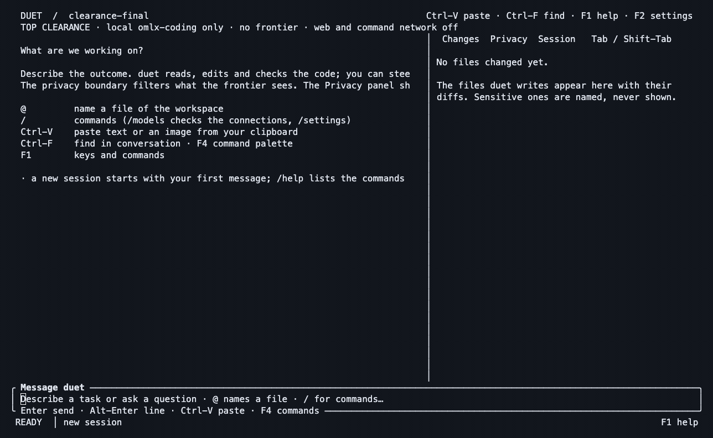

# Real TUI runs. Inspectable evidence.

The final hybrid task fixed a billing bug, passed **4/4 tests**, and recorded **zero matches for 13 planted values across four frontier requests**. Two preceding runs leaked fictional values. Both failed audits are retained here. This is a small live dogfood, not a benchmark, independent assessment or proof of universal privacy.

Recorded October 1, 2026 in Toronto (October 2 UTC). All customer records and the database password are invented. Code used for the successful captures: [`c9e1d5a`](../../crates/duet-boundary/src/engine.rs), with binary and artifact digests in the [manifest](../evidence/launch-2026-10-01/manifest.json).

A [fresh capture of the same task](FRESH_DOGFOOD.md) accompanies the revised README. It has its own run ID, five frontier requests, original recording and checks; the runs below are the earlier failure/fix sequence.

## Watch the workflow


The frontier receives an allowed view of a sensitive CSV, changes a substring status check to an exact comparison, and passes the task checks. The Privacy panel lets the operator inspect handling and the outbound record. The model's final statement about privacy is **not the evidence**; the independent canary check below is.

[MP4 for LinkedIn](../assets/launch/duet-privacy.mp4) · [Privacy still](../assets/launch/duet-privacy.png) · [Code-change still](../assets/launch/duet-changes.png) · [Outbound-detail still](../assets/launch/duet-outbound.png)

## What the first run found

| Run | Code state | Coding tests | Complete planted-value occurrences in recorded frontier requests |
| --- | --- | ---: | ---: |
| `20261002-010910-f40d96` | Development snapshot `a36cee7` | 4/4 passed | **36 — failed** |
| `20261002-014943-f0e51f` | Diagnostic-preview fix only | 4/4 passed | **9 — failed** |
| `20261002-015935-813200` | Both fixes, `c9e1d5a` | **4/4 passed** | **0 observed** |

Each run made four frontier requests. Counts include repeated values as conversation history is sent again; they are not counts of distinct people or unique leaks.

**Failure 1: a diagnostic shortcut disclosed CSV fields.** A reserved-domain email containing `.invalid` matched an error keyword. A detector-only preview removed names but carried arbitrary customer IDs, emails and amounts into the frontier context. The first run's amounts also appeared in the local digest. Its audit verified successfully: integrity did not mean the content was safe.

The new transport regression first [failed with planted values in the frontier's request](../evidence/launch-2026-10-01/regression-before.txt). The engine now restricts that diagnostic preview and its legacy repeated-line fallback to explicit `.log` files. Other sensitive sources use structure, synthetic samples and checked local answers. The boundary regression covers CSV, text and JSON paths with structure views both enabled and disabled. Arbitrary fields inside logs still need classification; a `.log` extension is not proof its content is safe.

**Failure 2: the local digest quoted short monetary amounts.** After the preview fix, the local model repeated `125.50`, `900.00` and `74.50`. Those exact values escaped the copied-span and secret-pattern checks. Local output now also checks the structured-value index, including decoded forms; public words already known from open code and existing placeholders retain their meaning. This matcher covers indexed values of at least four characters, with the existing 200,000-value cap. Fragments, unrecognized formats and semantic inference remain outside this particular guarantee.

The final rerun completed in **29.1 seconds**. It made one local digest request and four frontier requests; the TUI showed approximately **$0.0015 modeled frontier cost**. This is not an invoice, total operating cost or paired saving. The configured local rates were zero, meaning local hardware/energy costs were not accounted for.

| Inspect | Artifact |
| --- | --- |
| Before fixes | [Audit](../evidence/launch-2026-10-01/before-fix-audit.jsonl), [canary report](../evidence/launch-2026-10-01/before-fix-canaries.json), [verification](../evidence/launch-2026-10-01/before-fix-audit-verify.txt) |
| After preview fix only | [Audit](../evidence/launch-2026-10-01/intermediate-audit.jsonl), [canary report](../evidence/launch-2026-10-01/intermediate-canaries.json) |
| After both fixes | [Audit](../evidence/launch-2026-10-01/hybrid-audit.jsonl), [canary report](../evidence/launch-2026-10-01/canary-check.json), [transcript](../evidence/launch-2026-10-01/hybrid-transcript.jsonl) |
| Actual code and checks | [One-line patch](../evidence/launch-2026-10-01/billing-fix.patch), [failing fixture tests before](../evidence/launch-2026-10-01/before-tests.txt), [4/4 after](../evidence/launch-2026-10-01/after-tests.txt) |
| Accounting | [Economics](../evidence/launch-2026-10-01/hybrid-economics.json), [run metadata](../evidence/launch-2026-10-01/hybrid-run.json) |

## Verify the outbound content yourself

From the repository root, Python 3 is sufficient:

```sh
python3 tools/check-launch-canaries.py \
  docs/evidence/launch-2026-10-01/hybrid-audit.jsonl \
  docs/launch/billing-demo

# Expected failure: exit 1 and 36 matches.
python3 tools/check-launch-canaries.py \
  docs/evidence/launch-2026-10-01/before-fix-audit.jsonl \
  docs/launch/billing-demo
```

The independent checker reads the **recorded request bodies** and looks for the 13 complete fixture values in literal, base64, hex and URL-encoded forms. Identical encodings count once. It does not capture network packets, prove provider receipt, recognize every encoding, or test all fragments and paraphrases. The final zero is scoped to that check. The [scripted transport tests](../../crates/duet-cli/tests/privacy_scenarios.rs) inspect a receiving endpoint and are a separate kind of evidence.

## Verify the log, then detect a changed copy


The original has eight records and a matching external anchor. For the negative control, we changed only the last record's `model` field in a **copy**, preserving every preceding line. Its internal chain still verifies; the original external anchor detects the changed head and the CLI exits **1**. The source audit was not modified.

[MP4](../assets/launch/duet-audit.mp4) · [TUI still](../assets/launch/duet-audit.png) · [Original verification](../evidence/launch-2026-10-01/hybrid-audit-verify.txt) · [Tampered copy](../evidence/launch-2026-10-01/tampered-audit.jsonl) · [Rejected verification](../evidence/launch-2026-10-01/tampered-audit-verify.txt)

Check the published files without installing Duet:

```sh
python3 tools/verify-launch-audit.py \
  docs/evidence/launch-2026-10-01/hybrid-audit.jsonl \
  docs/evidence/launch-2026-10-01/hybrid-anchor.json

# Expected: chain/body checks pass, supplied anchor differs, exit 1.
python3 tools/verify-launch-audit.py \
  docs/evidence/launch-2026-10-01/tampered-audit.jsonl \
  docs/evidence/launch-2026-10-01/hybrid-anchor.json
```

This small independent verifier checks this packet's serialization. A bundled anchor establishes artifact consistency, **not independently trusted custody or authorship**. For a new run, use Duet's verifier while retaining its owner-state anchor outside the repository. An attacker controlling both can replace both. Audit and transcript files need access controls and appropriate retention; local-model requests can contain raw sensitive content.

The CLI [disclosure report](../evidence/launch-2026-10-01/hybrid-disclosure.txt) is also retained. Interactive sessions can lack per-result counts when no `summary.json` exists. Missing counts do not establish zero disclosure.

## A separate top-clearance task



Run `20261002-020143-2d4f8b` used the configured local model as the coding agent and repaired the same bug in **28.3 seconds**, with **4/4 tests passing**. Its eight audit records contain **five model requests, all to the local endpoint, and no frontier requests**. This task asked it to read code and tests; it did not demonstrate reading the customer CSV. It is not a frontier-parity evaluation or an independent network trace.

[MP4](../assets/launch/duet-top-clearance.mp4) · [Still](../assets/launch/duet-top-clearance.png) · [Audit](../evidence/launch-2026-10-01/top-clearance-audit.jsonl) · [Transcript](../evidence/launch-2026-10-01/top-clearance-transcript.jsonl) · [Verification](../evidence/launch-2026-10-01/top-clearance-audit-verify.txt) · [Tests](../evidence/launch-2026-10-01/top-clearance-tests.txt)

## Endpoint and capture limits

- Frontier: configured Z.ai endpoint, model `glm-5.3-flash`. Model identity is the provider identifier, not an independently verified weight hash.
- Local: alias `omlx-coding` at an owner-configured **LAN HTTP endpoint**. The underlying weights/version were not established. Existing owner settings explicitly allowlisted that endpoint and opted into plaintext. Synthetic sensitive data crossed this LAN connection; this is **not same-device, encrypted-transport or production deployment evidence**. For real sensitive content, use an approved loopback endpoint or a secured self-hosted endpoint/path.
- Sandbox command networking was set to `off`; subagents were disabled; frontier task/session caps were $0.30/$0.60. No real financial/customer records were used.
- TUI/CLI wording now describes the configured endpoint and disabled frontier/web/command paths. The successful capture revision predates a final wording-only correction to the handle/tool description: “on this machine” in that recorded description must not be read as a networking guarantee. The original bytes remain unchanged.
- Terminal: actual Duet process in a controlling PTY, 130 columns × 36 rows, displayed in xterm.js 5.5.0 with Menlo 16. The audit CLI segment uses 24 rows and is letterboxed. No screen text, results or UI states were fabricated.
- GIFs play selected original frames at 3 fps; pauses are cut and important states held. The privacy clip opens with the completed Privacy panel, then replays the task and inspection. MP4s encode the same edits at 30 fps. They are **edited highlights, not real-time duration evidence**. Duration comes from the saved transcript. The audit clip joins the TUI inspection and the separately recorded CLI negative control.

[Capture tool](../../tools/capture-tui.py) · [Replay renderer](../../tools/render-tui-cast.cjs) · [Original recordings and edit map](../evidence/launch-2026-10-01/manifest.json) · [Validation report](VALIDATION.md)

The compressed asciicast recordings contain actual timestamped PTY output. Decompress with `gzip -dc` and play with an asciicast-compatible player, or use the included renderer and the manifest's frame timestamps. Publish only recordings from disposable synthetic workspaces; real sessions can contain sensitive information.

## Reproduce the task

Build Duet and configure your own approved endpoints using [the usage guide](../USAGE.md). Model outputs and timing will vary. From the Duet repository root:

```sh
demo_dir=$(mktemp -d "${TMPDIR:-/tmp}/duet-billing.XXXXXX")
cp -R docs/launch/billing-demo/. "$demo_dir/"
cp "$demo_dir/env.example" "$demo_dir/.env"
git -C "$demo_dir" init
git -C "$demo_dir" add .
git -C "$demo_dir" commit -m 'Synthetic billing fixture'
cd "$demo_dir"
python3 -m unittest -v  # expected: one failure before the repair
duet --check 'python3 -m unittest -v'
```

Paste the supplied [prompt](billing-demo/prompt.txt). After completion, note the run ID in `/audit`, inspect Privacy and Changes, then run:

```sh
duet audit show <run-id>
duet audit verify <run-id>
duet audit disclosure <run-id>
python3 -m unittest -v
```

Run `tools/check-launch-canaries.py` from the Duet checkout against this workspace's `.duet/audit/<run-id>.jsonl` and the original fixture. For a separate top-clearance trial, start with a fresh fixture, set `duet config set --project clearance.required top`, and ask it to repair the bug using `billing.py` and `test_billing.py`. Confirm the recorded model endpoints yourself.
