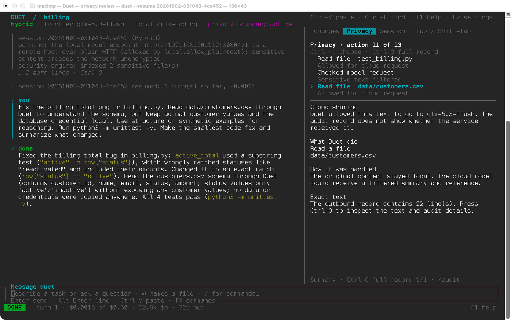
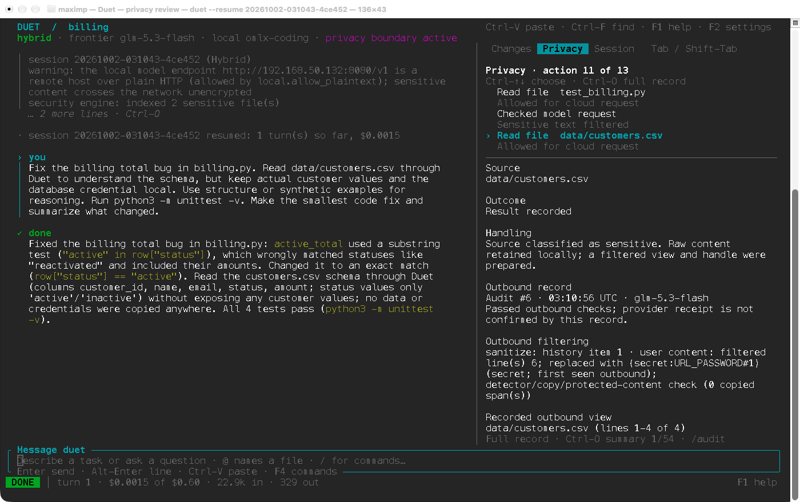
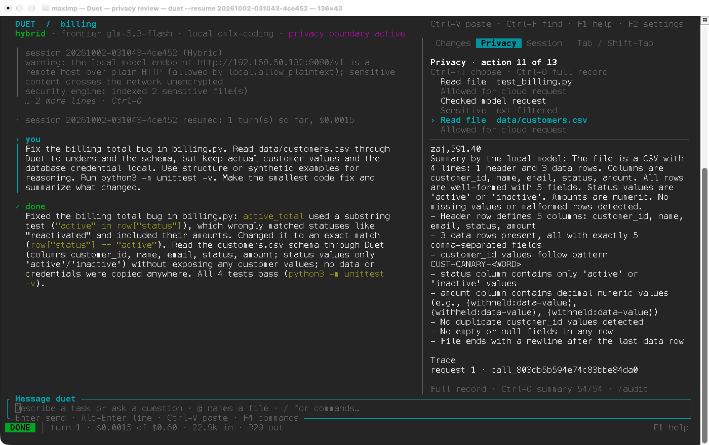
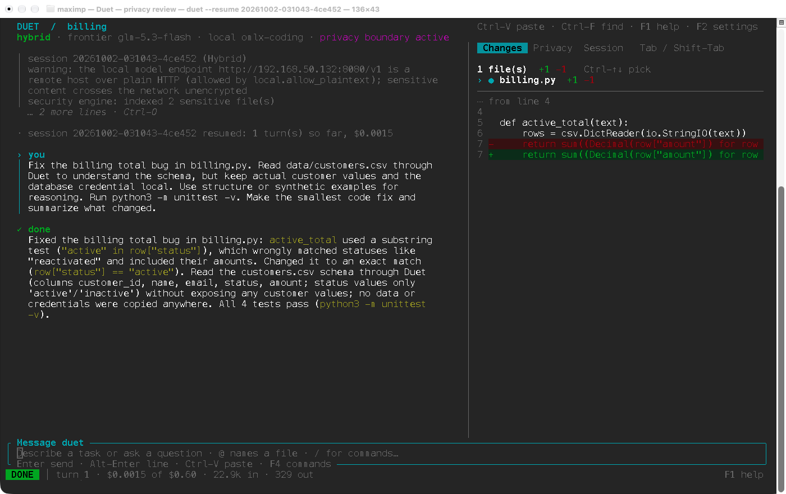

# Duet in Terminal: screenshots, task results and audit checks

The README shows the completed [October 4 billing session](../evidence/billing-demo-2026-10-04/README.md). Its evidence page retains all four live TUI screenshots, **4/4 passing tests**, and **zero matches for 13 complete planted values in four recorded frontier requests**.

The earlier color GIF below uses actual macOS screenshots of Duet. Its source billing run passed **4/4 tests**, with **zero matches for 13 complete planted values in five recorded frontier requests**. Earlier disclosure failures remain available below. These synthetic demonstrations are historical evidence, not a paired benchmark or a guarantee of privacy.

## Native screenshots

| Sensitive-file handling | Outbound record |
| --- | --- |
|  |  |

| Filtered local answer | Code change |
| --- | --- |
|  |  |

The [earlier demo GIF](../assets/launch/duet-security.gif) holds these four screenshots for five seconds each. The PNGs are unchanged `screencapture` output, including the Terminal.app window frame: no browser replay, generated screen or text replacement. Playback length does not measure coding time.

Captured October 2, 2026 in Terminal.app 2.15, Pro profile, Menlo 16, with `NO_COLOR` unset. Duet reopened a disposable copy of session `20261002-031043-4ce452`; no new model requests were made. Reopening added lifecycle events only to that copy. The published original audit is unchanged. The [native-capture manifest](../evidence/readme-native-2026-10-02/manifest.json) binds the capture binary and all five media files.

## Verified billing run

Run `20261002-031043-4ce452` repaired a substring status check that incorrectly included inactive accounts. It changed the comparison to equality and passed the required task check. The customer data and database password were fictional.

| Check | Result and saved evidence |
| --- | --- |
| Task and acceptance command | [Run metadata](../evidence/launch-refresh-2026-10-01/run.json) |
| Coding result | One-line [patch](../evidence/launch-refresh-2026-10-01/billing-fix.patch); [one failing test before](../evidence/launch-refresh-2026-10-01/before-tests.txt), [4/4 passing after](../evidence/launch-refresh-2026-10-01/after-tests.txt) |
| Planted-value check | **0 matches / 13 complete values / 5 frontier requests**; [report](../evidence/launch-refresh-2026-10-01/canary-check.json) |
| Recorded outbound content | [Original audit](../evidence/launch-refresh-2026-10-01/hybrid-audit.jsonl), nine records |
| Record integrity | [CLI verification](../evidence/launch-refresh-2026-10-01/audit-verify.txt), [independent check](../evidence/launch-refresh-2026-10-01/audit-check.json), [anchor](../evidence/launch-refresh-2026-10-01/hybrid-anchor.json) |
| Timing and accounting | [Transcript](../evidence/launch-refresh-2026-10-01/transcript.jsonl), [economics](../evidence/launch-refresh-2026-10-01/economics.json) |
| Build and recording provenance | [Manifest](../evidence/launch-refresh-2026-10-01/manifest.json), source `c9e1d5aaa427ad19b4650529f73079cbfe81c973` |

The coding turn took 29.9 seconds, with one local digest request and five frontier requests. Its modeled frontier cost was $0.00146704. Local token rates were zero, so hardware, energy and operator time were excluded. These figures are not an invoice or a comparative cost result.

The outbound view retained schema, row count, status vocabulary and a customer-ID pattern while withholding amounts. **Zero complete-value matches does not mean zero information disclosure.** The model's recorded explanation also incorrectly says “reactivated”; the fixture concerns “inactive”. The patch and tests establish the correction, not the model's explanation.

Verify the saved run offline from the repository root; neither command needs a model or API key:

```sh
python3 tools/check-launch-canaries.py \
  docs/evidence/launch-refresh-2026-10-01/hybrid-audit.jsonl \
  docs/launch/billing-demo

python3 tools/verify-launch-audit.py \
  docs/evidence/launch-refresh-2026-10-01/hybrid-audit.jsonl \
  docs/evidence/launch-refresh-2026-10-01/hybrid-anchor.json
```

Both exit 0. The canary checker reads recorded request bodies and checks complete fixture values in literal, base64, hex and URL-encoded forms. It does not establish provider receipt, cover every encoding or network path, or detect all fragments and paraphrases. [Receiving-endpoint transport tests](../../crates/duet-cli/tests/privacy_scenarios.rs) provide separate evidence.

## What the first run found

| Earlier run | Code state | Coding tests | Recorded planted-value occurrences |
| --- | --- | ---: | ---: |
| `20261002-010910-f40d96` | Development snapshot `a36cee7` | 4/4 | **36 — failed** |
| `20261002-014943-f0e51f` | Diagnostic-preview fix only | 4/4 | **9 — failed** |
| `20261002-015935-813200` | Both fixes, `c9e1d5a` | 4/4 | **0 observed** |

Each earlier run made four frontier requests. Repeated appearances in conversation history count separately; these are not unique people or secrets. The later five-request run above is a distinct run.

The first failure came from a diagnostic shortcut: a reserved-domain email matched an error keyword, causing arbitrary CSV fields to enter a detector-only preview. The audit still verified: integrity did not establish safe content. The [regression failed before the fix](../evidence/launch-2026-10-01/regression-before.txt). Diagnostic previews and their repeated-line fallback were then restricted to explicit `.log` files; a log extension alone still does not establish safe content.

The second failure came from short monetary values repeated by the local digest. Structured-value checks were added, including decoded forms, for indexed values of at least four characters under the existing 200,000-value cap. Fragments, unrecognized formats and semantic inference remain limitations.

| Preserved evidence | Artifacts |
| --- | --- |
| Before fixes | [Audit](../evidence/launch-2026-10-01/before-fix-audit.jsonl), [36-match report](../evidence/launch-2026-10-01/before-fix-canaries.json), [integrity verification](../evidence/launch-2026-10-01/before-fix-audit-verify.txt) |
| Preview fix only | [Audit](../evidence/launch-2026-10-01/intermediate-audit.jsonl), [9-match report](../evidence/launch-2026-10-01/intermediate-canaries.json) |
| Both fixes | [Audit](../evidence/launch-2026-10-01/hybrid-audit.jsonl), [zero-match report](../evidence/launch-2026-10-01/canary-check.json), [transcript](../evidence/launch-2026-10-01/hybrid-transcript.jsonl) |
| Earlier build, media and tests | [Manifest](../evidence/launch-2026-10-01/manifest.json), [historical validation](https://github.com/maximpri/duet/blob/9b0ac104ba6947e338ca3baacfd31de2c2823e83/docs/launch/VALIDATION.md) |

The original failed disclosure check remains reproducible:

```sh
# Expected: exit 1 and 36 matches.
python3 tools/check-launch-canaries.py \
  docs/evidence/launch-2026-10-01/before-fix-audit.jsonl \
  docs/launch/billing-demo
```

## Verify the log, then detect a changed copy

The earlier successful audit has eight records and a matching external anchor. The negative control changes only the final record's `model` field in a copy. Its internal chain still verifies, but the original anchor detects the changed head. The source audit was not modified.

```sh
python3 tools/verify-launch-audit.py \
  docs/evidence/launch-2026-10-01/hybrid-audit.jsonl \
  docs/evidence/launch-2026-10-01/hybrid-anchor.json

# Expected: chain/body checks pass, supplied anchor differs, exit 1.
python3 tools/verify-launch-audit.py \
  docs/evidence/launch-2026-10-01/tampered-audit.jsonl \
  docs/evidence/launch-2026-10-01/hybrid-anchor.json
```

[Original CLI verification](../evidence/launch-2026-10-01/hybrid-audit-verify.txt) · [Tampered copy](../evidence/launch-2026-10-01/tampered-audit.jsonl) · [Rejected verification](../evidence/launch-2026-10-01/tampered-audit-verify.txt)

The independent script checks this packet's serialization. A bundled anchor establishes consistency, not independent custody or authorship. For new runs, use Duet's verifier and retain the owner-state anchor separately; an attacker controlling both can replace both. Audits and transcripts need access controls because local requests can contain raw sensitive content. Missing disclosure counts in sessions without a summary do not establish zero disclosure.

## Top clearance and endpoint scope

The separate top-clearance run `20261002-020143-2d4f8b` repaired the same bug and passed 4/4 tests. Its eight audit records contain five model requests, all to the configured local endpoint, and no frontier requests. It read code and tests; this run did not demonstrate reading the customer CSV. It is not a frontier-parity evaluation or an independent network trace.

[Top-clearance audit](../evidence/launch-2026-10-01/top-clearance-audit.jsonl) · [Transcript](../evidence/launch-2026-10-01/top-clearance-transcript.jsonl) · [Verification](../evidence/launch-2026-10-01/top-clearance-audit-verify.txt) · [Tests](../evidence/launch-2026-10-01/top-clearance-tests.txt)

These captures used `glm-5.3-flash` as the frontier identifier and `omlx-coding` on an owner-allowlisted **plaintext LAN endpoint** as the local alias. Underlying weights were not independently verified. Synthetic sensitive content crossed that LAN connection; the recordings do not establish same-device processing or encrypted transport. An older recorded “on this machine” phrase must be read with this limitation. Use approved endpoints and secured paths for real data.

Command networking was off, subagents were disabled, and task/session frontier caps were $0.30/$0.60. The frontier audit does not itself capture the local model's raw request body. These historical captures do not represent every later application revision.

## Reproduce the task

Configure your own approved endpoints using [the usage guide](../USAGE.md). From the repository root, copy the unchanged [synthetic fixture](billing-demo/README.md):

```sh
demo_dir=$(mktemp -d "${TMPDIR:-/tmp}/duet-billing.XXXXXX")
cp -R docs/launch/billing-demo/. "$demo_dir/"
cp "$demo_dir/env.example" "$demo_dir/.env"
git -C "$demo_dir" init
git -C "$demo_dir" add .
git -C "$demo_dir" commit -m 'Synthetic billing fixture'
cd "$demo_dir"
python3 -m unittest -v  # expected: one failure before the repair
duet --check 'python3 -m unittest -v'
```

Paste the [supplied prompt](billing-demo/prompt.txt). After completion, inspect Privacy and Changes, note the run ID in `/audit`, and check:

```sh
duet audit show <run-id>
duet audit verify <run-id>
duet audit disclosure <run-id>
python3 -m unittest -v
```

From the Duet checkout, run the canary checker against the new workspace's `.duet/audit/<run-id>.jsonl` and the original fixture. For a separate local-agent trial, start with a fresh fixture and set `duet config set --project clearance.required top`. Ask it to repair the bug using `billing.py` and `test_billing.py`, then confirm the recorded endpoints. Outputs and timing may differ.

## Record a new demo

[`tools/duet-recorder`](../../tools/duet-recorder/README.md) runs the real `duet` binary on a fresh copy of the billing fixture, types the task, and renders the recorded terminal bytes as a GIF, MP4 and stills. Each recording saves its cast, the tests before and after, and the planted-value check over every frontier request:

```sh
python3 tools/duet-recorder/record.py --install-deps
python3 tools/duet-recorder/record.py --out /tmp/duet-demo
```

Sped-up playback is labelled in the window. Playback length is not task duration.

## Capture and rebuild

Capture Duet's native Terminal window directly with `screencapture -x -o -l <window-id> screenshot.png`. Rebuild the earlier demo GIF from the four unchanged committed PNGs, from the repository root:

```sh
ffmpeg -hide_banner -y -safe 0 -f concat \
  -i docs/evidence/readme-native-2026-10-02/frames.ffconcat \
  -filter_complex '[0:v]split[a][b];[a]palettegen=stats_mode=full[p];[b][p]paletteuse=dither=bayer:bayer_scale=3' \
  -fps_mode vfr -t 20 -final_delay 500 -loop 0 /tmp/duet-security.gif
```

The older replay media remain bound in the [original manifest](../evidence/launch-2026-10-01/manifest.json), [refresh manifest](../evidence/launch-refresh-2026-10-01/manifest.json) and [archived color replay](../evidence/readme-color-2026-10-02/manifest.json). They use actual timestamped PTY output rendered with xterm.js, not native screenshot capture. Edited playback is not task-duration evidence.

To rebuild the refreshed replay, use Python 3, Node, ffmpeg, Chrome, `@playwright/test@1.58.2` and `@xterm/xterm@5.5.0`. Install Node dependencies outside the checkout:

```sh
NODE_PATH=/path/to/capture/node_modules python3 tools/build-launch-reel.py \
  --xterm /path/to/capture/node_modules/@xterm/xterm \
  --chrome '/path/to/Google Chrome' \
  --output /tmp/duet-rebuilt-media
```

The [builder](../../tools/build-launch-reel.py) applies the saved [edit map](../evidence/launch-refresh-2026-10-01/reel-edit.json) to the [compressed recording](../evidence/launch-refresh-2026-10-01/hybrid.cast.gz). [Original capture tool](https://github.com/maximpri/duet/blob/657b8a40d537b64fd81e063d26f1bd93e8caaa31/tools/capture-tui.py) · [Replay renderer](../../tools/render-tui-cast.cjs). Fonts, browsers and encoders can change pixel hashes. Capture only disposable synthetic workspaces for publication; real sessions can contain sensitive information.
